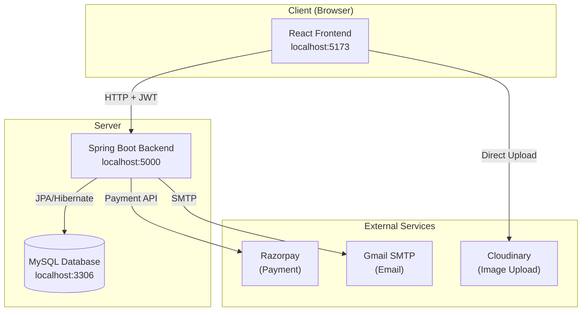
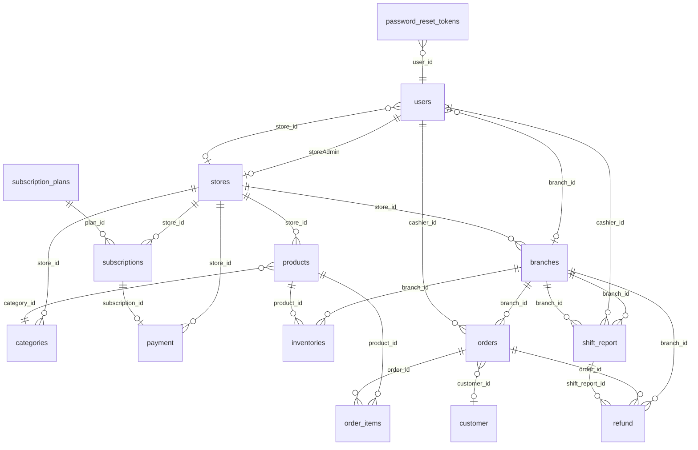

# 📖 TÀI LIỆU HỆ THỐNG POS ĐA CHI NHÁNH — PHẦN 1: TỔNG QUAN & DATABASE

> **Dự án:** Zosh POS — Hệ thống điểm bán hàng đa chi nhánh cho chuỗi bán lẻ
> **Mục đích tài liệu:** Giúp người đọc hiểu 100% hệ thống từ A-Z

---

## 1. DỰ ÁN NÀY LÀ GÌ?

Zosh POS là một **hệ thống quản lý bán hàng trực tuyến (Point of Sale)** dành cho chuỗi cửa hàng bán lẻ. Hệ thống cho phép:

- **Chủ cửa hàng (Store Admin)** tạo và quản lý nhiều chi nhánh, sản phẩm, nhân viên
- **Quản lý chi nhánh (Branch Manager)** theo dõi đơn hàng, tồn kho, nhân viên tại chi nhánh
- **Thu ngân (Cashier)** bán hàng tại quầy, tạo đơn hàng, hoàn trả, quản lý ca
- **Quản trị viên hệ thống (Super Admin)** duyệt cửa hàng mới, quản lý gói dịch vụ

Đây là mô hình **multi-tenant** — nhiều cửa hàng hoạt động độc lập trên cùng một hệ thống.

---

## 2. CÔNG NGHỆ SỬ DỤNG

### 2.1 Frontend
| Công nghệ | Phiên bản | Vai trò |
|------------|-----------|---------|
| React | 19 | Thư viện UI chính, render giao diện |
| Vite | 7 | Build tool, dev server nhanh |
| Redux Toolkit | latest | Quản lý state toàn cục (giỏ hàng, user, orders...) |
| React Router | v7 | Điều hướng SPA (Single Page Application) |
| Tailwind CSS | v4 | Framework CSS utility-first |
| shadcn/ui (Radix UI) | latest | 48 components UI sẵn (Button, Dialog, Table...) |
| Axios | latest | Gọi HTTP API tới backend |
| Recharts | latest | Vẽ biểu đồ (chart) cho dashboard |
| Zod / Yup | latest | Validate form data |
| Cloudinary | — | Upload ảnh sản phẩm lên cloud |

### 2.2 Backend
| Công nghệ | Phiên bản | Vai trò |
|------------|-----------|---------|
| Spring Boot | 3.5.3 | Framework Java để xây dựng REST API |
| Spring Security | — | Xác thực & phân quyền |
| Spring Data JPA | — | ORM — ánh xạ Java class ↔ MySQL table |
| Hibernate | — | Implementation của JPA |
| MySQL | 8.0 | Cơ sở dữ liệu quan hệ |
| JWT (jjwt) | 0.12.6 | Token xác thực người dùng |
| Lombok | — | Tự sinh getter/setter/constructor |
| Razorpay SDK | 1.4.8 | Cổng thanh toán trực tuyến |
| Stripe SDK | 28.3.1 | Cổng thanh toán trực tuyến (backup) |
| Spring Mail | — | Gửi email (reset password) |
| Bean Validation | — | Validate dữ liệu đầu vào |

### 2.3 DevOps
| Công nghệ | Vai trò |
|------------|---------|
| Docker + Docker Compose | Container hóa ứng dụng |
| Jib Maven Plugin | Build Docker image từ Maven |
| Git | Quản lý source code |

---

## 3. KIẾN TRÚC HỆ THỐNG

### 3.1 Sơ đồ tổng thể



### 3.2 Luồng request cơ bản

```
1. User tương tác trên trình duyệt (click, nhập form...)
2. React component dispatch Redux thunk
3. Thunk gọi Axios → HTTP request tới localhost:5000
4. Request đi qua JwtValidator filter (kiểm tra token)
5. Controller nhận request → gọi Service
6. Service xử lý business logic → gọi Repository
7. Repository thực thi SQL query trên MySQL
8. Kết quả trả ngược: DB → Repository → Service → Mapper(DTO) → Controller → JSON → Frontend
9. Redux cập nhật state → React re-render UI
```

---

## 4. CÁC VAI TRÒ TRONG HỆ THỐNG (7 roles)

| Role | Enum | Mô tả | Truy cập |
|------|------|--------|----------|
| **Super Admin** | `ROLE_ADMIN` | Quản trị viên toàn hệ thống. Duyệt/chặn cửa hàng, quản lý gói subscription | `/super-admin/*` |
| **Store Admin** | `ROLE_STORE_ADMIN` | Chủ cửa hàng. Tạo chi nhánh, sản phẩm, thêm nhân viên, xem báo cáo toàn store | `/store/*` |
| **Store Manager** | `ROLE_STORE_MANAGER` | Quản lý cửa hàng. Quyền tương tự Store Admin nhưng không phải chủ | `/store/*` |
| **Branch Manager** | `ROLE_BRANCH_MANAGER` | Quản lý chi nhánh. Xem orders, inventory, employees, reports của chi nhánh | `/branch/*` |
| **Branch Admin** | `ROLE_BRANCH_ADMIN` | Admin chi nhánh (tương tự Branch Manager) | `/branch/*` |
| **Branch Cashier** | `ROLE_BRANCH_CASHIER` | Thu ngân. Bán hàng, tạo đơn, hoàn trả, quản lý ca | `/cashier/*` |
| **Customer** | `ROLE_CUSTOMER` | Khách hàng (dùng nội bộ, không login) | — |

---

## 5. DATABASE — CHI TIẾT TỪNG BẢNG

### 5.1 Sơ đồ quan hệ (ER Diagram)



### 5.2 Bảng `users` — Người dùng

> File: [User.java](file:///Users/Study/DOAN/z%20pos-source-code_1/pos-backend/src/main/java/com/zosh/modal/User.java)

| Cột | Kiểu | Ràng buộc | Mô tả |
|-----|------|-----------|-------|
| `id` | BIGINT | PK, AUTO_INCREMENT | ID tự tăng |
| `full_name` | VARCHAR | NOT BLANK | Họ tên đầy đủ |
| `email` | VARCHAR | NOT BLANK, UNIQUE, @Email | Email đăng nhập (không trùng) |
| `password` | VARCHAR | — | Mật khẩu đã mã hóa BCrypt |
| `phone` | VARCHAR | — | Số điện thoại |
| `role` | ENUM | NOT NULL | Một trong 7 role ở mục 4 |
| `store_id` | BIGINT | FK → stores | Cửa hàng mà user thuộc về (null nếu là Super Admin) |
| `branch_id` | BIGINT | FK → branches | Chi nhánh mà user thuộc về (null nếu là Store Admin) |
| `verified` | BOOLEAN | NOT NULL, default=false | Tài khoản đã xác minh chưa |
| `last_login` | DATETIME | — | Thời điểm login gần nhất |
| `created_at` | DATETIME | NOT NULL, auto | Ngày tạo tài khoản |
| `updated_at` | DATETIME | NOT NULL, auto | Ngày cập nhật gần nhất |

**Quan hệ:**
- `@ManyToOne Store store` — User thuộc về 1 Store
- `@ManyToOne Branch branch` — User thuộc về 1 Branch

---

### 5.3 Bảng `stores` — Cửa hàng

> File: [Store.java](file:///Users/Study/DOAN/z%20pos-source-code_1/pos-backend/src/main/java/com/zosh/modal/Store.java)

| Cột | Kiểu | Ràng buộc | Mô tả |
|-----|------|-----------|-------|
| `id` | BIGINT | PK, AUTO | ID cửa hàng |
| `brand` | VARCHAR | NOT BLANK | Tên thương hiệu |
| `store_admin_id` | BIGINT | FK → users | Chủ cửa hàng (1-1) |
| `description` | VARCHAR | — | Mô tả cửa hàng |
| `store_type` | VARCHAR | — | Loại cửa hàng (ví dụ: "Retail", "F&B") |
| `status` | ENUM | — | `PENDING` (chờ duyệt), `ACTIVE` (hoạt động), `BLOCKED` (bị chặn) |
| `address` | VARCHAR | — | Địa chỉ (embedded StoreContact) |
| `phone` | VARCHAR | — | SĐT liên hệ (embedded) |
| `email` | VARCHAR | — | Email liên hệ (embedded) |
| `created_at` | DATETIME | auto | Ngày tạo |
| `updated_at` | DATETIME | auto | Ngày cập nhật |

**Quan hệ:** `@OneToOne User storeAdmin`
**Lifecycle:** `@PrePersist` → set status=PENDING, createdAt=now

---

### 5.4 Bảng `branches` — Chi nhánh

> File: [Branch.java](file:///Users/Study/DOAN/z%20pos-source-code_1/pos-backend/src/main/java/com/zosh/modal/Branch.java)

| Cột | Kiểu | Mô tả |
|-----|------|-------|
| `id` | BIGINT PK | ID chi nhánh |
| `name` | VARCHAR | Tên chi nhánh |
| `address` | VARCHAR | Địa chỉ |
| `phone` | VARCHAR | SĐT |
| `email` | VARCHAR | Email |
| `open_time` | TIME | Giờ mở cửa |
| `close_time` | TIME | Giờ đóng cửa |
| `store_id` | BIGINT FK | Thuộc cửa hàng nào |
| `manager_id` | BIGINT FK | Quản lý chi nhánh (1-1 with User) |

**Bảng phụ:** `branch_working_days` — lưu danh sách ngày làm việc (`["MONDAY","TUESDAY",...]`)

---

### 5.5 Bảng `products` — Sản phẩm

> File: [Product.java](file:///Users/Study/DOAN/z%20pos-source-code_1/pos-backend/src/main/java/com/zosh/modal/Product.java)

| Cột | Kiểu | Mô tả |
|-----|------|-------|
| `id` | BIGINT PK | ID sản phẩm |
| `name` | VARCHAR NOT NULL | Tên sản phẩm |
| `sku` | VARCHAR UNIQUE NOT NULL | Mã sản phẩm (Stock Keeping Unit) |
| `description` | VARCHAR | Mô tả |
| `mrp` | DOUBLE NOT NULL | Giá niêm yết (Maximum Retail Price) |
| `selling_price` | DOUBLE NOT NULL | Giá bán thực tế |
| `brand` | VARCHAR | Thương hiệu sản phẩm |
| `image` | VARCHAR | URL ảnh (Cloudinary) |
| `category_id` | BIGINT FK | Thuộc danh mục nào |
| `store_id` | BIGINT FK NOT NULL | Thuộc cửa hàng nào |

---

### 5.6 Bảng `categories` — Danh mục sản phẩm

| Cột | Kiểu | Mô tả |
|-----|------|-------|
| `id` | BIGINT PK | ID danh mục |
| `name` | VARCHAR | Tên danh mục (Thực phẩm, Đồ uống...) |
| `store_id` | BIGINT FK | Thuộc cửa hàng nào |

---

### 5.7 Bảng `orders` — Đơn hàng

> File: [Order.java](file:///Users/Study/DOAN/z%20pos-source-code_1/pos-backend/src/main/java/com/zosh/modal/Order.java)

| Cột | Kiểu | Mô tả |
|-----|------|-------|
| `id` | BIGINT PK AUTO_INCREMENT | Mã đơn hàng |
| `total_amount` | DOUBLE | Tổng tiền |
| `payment_type` | ENUM | `CASH` / `CARD` / `UPI` |
| `status` | ENUM | `COMPLETED` (default), `PENDING`, `REFUNDED`, `CANCELLED` |
| `branch_id` | BIGINT FK | Tại chi nhánh nào |
| `cashier_id` | BIGINT FK | Thu ngân nào tạo |
| `customer_id` | BIGINT FK | Khách hàng (có thể null) |
| `created_at` | DATETIME auto | Thời điểm tạo đơn |

---

### 5.8 Bảng `order_items` — Chi tiết đơn hàng

| Cột | Kiểu | Mô tả |
|-----|------|-------|
| `id` | BIGINT PK | ID |
| `quantity` | INT | Số lượng mua |
| `price` | DOUBLE | Thành tiền = sellingPrice × quantity |
| `product_id` | BIGINT FK | Sản phẩm nào |
| `order_id` | BIGINT FK | Thuộc đơn hàng nào |

---

### 5.9 Bảng `customer` — Khách hàng

| Cột | Kiểu | Mô tả |
|-----|------|-------|
| `id` | BIGINT PK | ID |
| `full_name` | VARCHAR NOT BLANK | Tên khách |
| `email` | VARCHAR | Email |
| `phone` | VARCHAR | SĐT |

---

### 5.10 Bảng `inventories` — Tồn kho

| Cột | Kiểu | Mô tả |
|-----|------|-------|
| `id` | BIGINT PK | ID |
| `branch_id` | BIGINT FK NOT NULL | Chi nhánh |
| `product_id` | BIGINT FK NOT NULL | Sản phẩm |
| `quantity` | INT NOT NULL | Số lượng tồn kho |
| `last_updated` | DATETIME auto | Lần cập nhật cuối |

> **Lưu ý:** Mỗi chi nhánh có bản ghi tồn kho riêng cho mỗi sản phẩm.

---

### 5.11 Bảng `shift_report` — Báo cáo ca làm việc

| Cột | Kiểu | Mô tả |
|-----|------|-------|
| `id` | BIGINT PK | ID |
| `shift_start` | DATETIME | Thời điểm bắt đầu ca |
| `shift_end` | DATETIME | Thời điểm kết thúc (null nếu đang diễn ra) |
| `total_sales` | DOUBLE | Tổng doanh thu trong ca |
| `total_refunds` | DOUBLE | Tổng hoàn trả |
| `net_sales` | DOUBLE | Doanh thu thuần = sales - refunds |
| `total_orders` | INT | Số đơn hàng |
| `cashier_id` | BIGINT FK | Thu ngân |
| `branch_id` | BIGINT FK | Chi nhánh |

**Transient fields** (không lưu DB, tính realtime):
- `paymentSummaries` — Thống kê theo phương thức thanh toán
- `topSellingProducts` — Top 5 sản phẩm bán chạy
- `recentOrders` — 5 đơn hàng gần nhất

---

### 5.12 Bảng `refund` — Hoàn trả

| Cột | Kiểu | Mô tả |
|-----|------|-------|
| `id` | BIGINT PK | ID |
| `order_id` | BIGINT FK | Đơn hàng bị hoàn |
| `reason` | VARCHAR | Lý do hoàn |
| `amount` | DOUBLE | Số tiền hoàn (= totalAmount của order) |
| `cashier_id` | BIGINT FK | Thu ngân xử lý |
| `branch_id` | BIGINT FK | Chi nhánh |
| `shift_report_id` | BIGINT FK | Ca làm việc |
| `payment_type` | ENUM | Phương thức hoàn |
| `created_at` | DATETIME | Thời điểm hoàn |

---

### 5.13 Bảng `subscription_plans` — Gói dịch vụ

| Cột | Kiểu | Mô tả |
|-----|------|-------|
| `id` | BIGINT PK | ID |
| `name` | VARCHAR NOT NULL | Tên gói (Starter, Pro...) |
| `description` | VARCHAR NOT NULL | Mô tả |
| `price` | DOUBLE NOT NULL | Giá gói |
| `billing_cycle` | ENUM | `MONTHLY` / `YEARLY` |
| `max_branches` | INT NOT NULL | Số chi nhánh tối đa |
| `max_users` | INT NOT NULL | Số nhân viên tối đa |
| `max_products` | INT NOT NULL | Số sản phẩm tối đa |
| `enable_advanced_reports` | BOOLEAN | Có báo cáo nâng cao? |
| `enable_inventory` | BOOLEAN | Có quản lý kho? |
| `enable_integrations` | BOOLEAN | Có tích hợp bên ngoài? |
| `enable_ecommerce` | BOOLEAN | Có kết nối bán online? |
| `enable_invoice_branding` | BOOLEAN | Có tùy chỉnh hóa đơn? |
| `priority_support` | BOOLEAN | Có hỗ trợ ưu tiên? |

---

### 5.14 Bảng `subscriptions` — Đăng ký dịch vụ

| Cột | Kiểu | Mô tả |
|-----|------|-------|
| `id` | BIGINT PK | ID |
| `store_id` | BIGINT FK NOT NULL | Cửa hàng đăng ký |
| `plan_id` | BIGINT FK NOT NULL | Gói dịch vụ |
| `start_date` | DATE NOT NULL | Ngày bắt đầu |
| `end_date` | DATE NOT NULL | Ngày hết hạn |
| `status` | ENUM | `TRIAL`, `ACTIVE`, `EXPIRED`, `CANCELLED` |
| `payment_gateway` | ENUM | `RAZORPAY` / `STRIPE` |
| `payment_status` | ENUM | `PENDING`, `SUCCESS`, `FAILED` |
| `transaction_id` | VARCHAR | Mã giao dịch |

---

### 5.15 Bảng `payment` — Thanh toán subscription

| Cột | Kiểu | Mô tả |
|-----|------|-------|
| `id` | BIGINT PK | ID |
| `store_id` | BIGINT FK | Cửa hàng |
| `subscription_id` | BIGINT FK | Subscription liên quan |
| `amount` | DOUBLE | Số tiền |
| `provider` | ENUM | RAZORPAY/STRIPE |
| `provider_payment_id` | VARCHAR | ID từ cổng thanh toán |
| `transaction_id` | VARCHAR | Mã giao dịch nội bộ |
| `method` | VARCHAR | Phương thức (CARD, UPI...) |
| `status` | ENUM | PENDING, SUCCESS, FAILED |
| `failure_reason` | VARCHAR | Lý do thất bại |
| `paid_at` | DATETIME | Thời điểm thanh toán |

---

### 5.16 Bảng `password_reset_tokens` — Token reset mật khẩu

| Cột | Kiểu | Mô tả |
|-----|------|-------|
| `id` | BIGINT PK | ID |
| `token` | VARCHAR UNIQUE NOT NULL | Token UUID |
| `user_id` | BIGINT FK NOT NULL | User yêu cầu reset |
| `expiry_date` | DATETIME NOT NULL | Hết hạn sau 5 phút |

---

## 6. THIẾT LẬP MÔI TRƯỜNG

### 6.1 Backend
```bash
# Yêu cầu: Java 17, MySQL 8.0
# 1. Tạo database MySQL
mysql -u root -p
CREATE DATABASE pos;

# 2. Cập nhật application.yml nếu cần (password, port)

# 3. Chạy backend
cd pos-backend
./mvnw spring-boot:run
# → Server chạy tại http://localhost:5000
```

### 6.2 Frontend
```bash
# Yêu cầu: Node.js 18+
cd pos-frontend-vite
npm install
npm run dev
# → App chạy tại http://localhost:5173
```

### 6.3 Docker (tùy chọn)
```bash
cd pos-backend/src/main/resources
docker-compose up -d
# → MySQL tại port 3301, App tại port 5000
```

---

> 📌 **Tiếp theo:** Xem [Phần 2 — Backend chi tiết](file:///Users/mac/.gemini/antigravity/brain/13203c2b-6a95-4a16-ae64-242424cd303b/artifacts/02_backend_chi_tiet.md)
