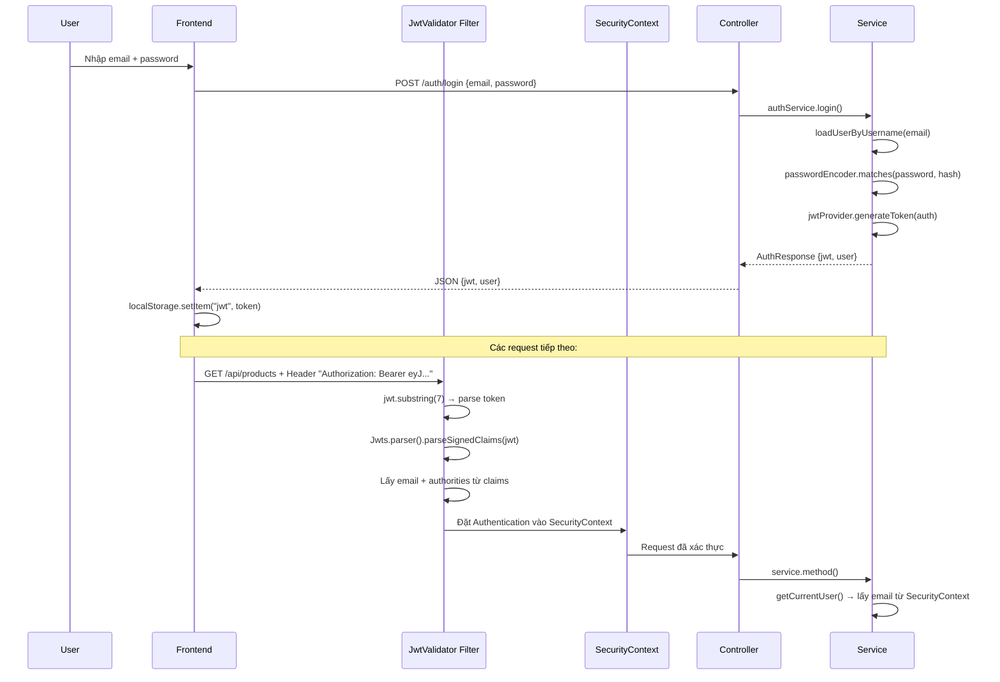

# 📖 PHẦN 2: BACKEND CHI TIẾT — SECURITY, CONTROLLER, SERVICE

---

## 7. BẢO MẬT & XÁC THỰC (Security)

### 7.1 JWT là gì?

JWT (JSON Web Token) là chuỗi mã hóa chứa thông tin user. Khi đăng nhập thành công, server tạo JWT và trả về client. Mỗi request tiếp theo, client gửi JWT trong header để server biết "ai đang gọi".

### 7.2 Luồng xác thực chi tiết



### 7.3 Cấu trúc JWT Token

```json
{
  "email": "user@example.com",      // Email đăng nhập
  "authorities": "ROLE_STORE_ADMIN", // Vai trò
  "iat": 1700000000,                 // Thời điểm tạo
  "exp": 1700086400                  // Hết hạn (24h sau)
}
```

### 7.4 File Security quan trọng

| File | Chức năng |
|------|-----------|
| [JwtConstant.java](file:///Users/Study/DOAN/z%20pos-source-code_1/pos-backend/src/main/java/com/zosh/configrations/JwtConstant.java) | Chứa `SECRET_KEY` (64 ký tự) dùng để ký/verify JWT |
| [JwtProvider.java](file:///Users/Study/DOAN/z%20pos-source-code_1/pos-backend/src/main/java/com/zosh/configrations/JwtProvider.java) | `generateToken()` — tạo JWT; `getEmailFromJwtToken()` — giải mã email |
| [JwtValidator.java](file:///Users/Study/DOAN/z%20pos-source-code_1/pos-backend/src/main/java/com/zosh/configrations/JwtValidator.java) | Filter chạy **trước mọi request**. Parse JWT → đặt vào SecurityContext |
| [SecurityConfig.java](file:///Users/Study/DOAN/z%20pos-source-code_1/pos-backend/src/main/java/com/zosh/configrations/SecurityConfig.java) | Cấu hình: `/auth/**` public, `/api/**` cần xác thực, CORS, stateless session |

### 7.5 Quy tắc phân quyền trên Controller

```java
@PreAuthorize("hasAuthority('ROLE_CASHIER')")        // Chỉ cashier
@PreAuthorize("hasAnyAuthority('ROLE_STORE_MANAGER', 'ROLE_STORE_ADMIN')") // Store level
@PreAuthorize("hasRole('BRANCH_MANAGER')")           // Branch level
```

---

## 8. TẤT CẢ API ENDPOINTS & SERVICE LOGIC

### 8.1 Auth — Xác thực

> Controller: [AuthController.java](file:///Users/Study/DOAN/z%20pos-source-code_1/pos-backend/src/main/java/com/zosh/controller/AuthController.java)
> Service: [AuthServiceImpl.java](file:///Users/Study/DOAN/z%20pos-source-code_1/pos-backend/src/main/java/com/zosh/service/impl/AuthServiceImpl.java)

#### `POST /auth/signup` — Đăng ký
```
Input: { fullName, email, password, phone, role }
Logic:
  1. Kiểm tra email đã tồn tại → throw "Email id already registered"
  2. Chặn role ADMIN (không cho tự đăng ký Super Admin)
  3. Tạo User, mã hóa password bằng BCrypt
  4. Lưu vào DB
  5. Tạo JWT token
  6. Trả về { jwt, user }
```

#### `POST /auth/login` — Đăng nhập
```
Input: { email, password }
Logic:
  1. loadUserByUsername(email) → tìm user trong DB
  2. So sánh password với hash: passwordEncoder.matches()
  3. Nếu đúng → tạo JWT token, cập nhật lastLogin
  4. Trả về { jwt, user }
```

#### `POST /auth/forgot-password` — Quên mật khẩu
```
Input: { email }
Logic:
  1. Tìm user theo email
  2. Tạo UUID token, hết hạn 5 phút
  3. Lưu vào bảng password_reset_tokens
  4. Gửi email chứa link reset: frontendUrl + token
```

#### `POST /auth/reset-password` — Đặt lại mật khẩu
```
Input: { token, password }
Logic:
  1. Tìm token trong DB
  2. Kiểm tra hết hạn → nếu expired, xóa token, throw lỗi
  3. Cập nhật password mới (BCrypt encode)
  4. Xóa token khỏi DB
```

---

### 8.2 Store — Quản lý cửa hàng

> Controller: [StoreController.java](file:///Users/Study/DOAN/z%20pos-source-code_1/pos-backend/src/main/java/com/zosh/controller/StoreController.java)
> Service: [StoreServiceImpl.java](file:///Users/Study/DOAN/z%20pos-source-code_1/pos-backend/src/main/java/com/zosh/service/impl/StoreServiceImpl.java)

| API | Logic chi tiết |
|-----|----------------|
| `POST /api/stores` | Lấy user từ JWT → tạo Store với user làm storeAdmin → status mặc định PENDING |
| `GET /api/stores/{id}` | Tìm store theo ID, throw nếu không tìm thấy |
| `PUT /api/stores/{id}` | Lấy currentUser → tìm store của user → cập nhật brand, description, type, contact |
| `DELETE /api/stores` | Lấy store của currentUser → xóa |
| `GET /api/stores/admin` | Tìm store bằng `storeAdminId = currentUser.id` |
| `GET /api/stores/employee` | Kiểm tra currentUser có store không → trả về store |
| `POST /api/stores/add/employee` | Tạo user mới với role + branch/store tương ứng, encode password |
| `PUT /api/stores/{storeId}/moderate` | **Super Admin only.** Đổi status store (ACTIVE/BLOCKED) |

---

### 8.3 Branch — Chi nhánh

> Service: [BranchServiceImpl.java](file:///Users/Study/DOAN/z%20pos-source-code_1/pos-backend/src/main/java/com/zosh/service/impl/BranchServiceImpl.java)

| API | Logic |
|-----|-------|
| `POST /api/branches` | Tìm store theo user → tạo branch thuộc store đó |
| `GET /api/branches/store/{storeId}` | Kiểm tra currentUser là storeAdmin hoặc storeManager → trả list branch |
| `PUT /api/branches/{id}` | Cập nhật name, address, phone, email, openTime, closeTime, workingDays |
| `DELETE /api/branches/{id}` | Kiểm tra tồn tại → xóa |

---

### 8.4 Product — Sản phẩm

> Service: [ProductServiceImpl.java](file:///Users/Study/DOAN/z%20pos-source-code_1/pos-backend/src/main/java/com/zosh/service/impl/ProductServiceImpl.java)

| API | Logic |
|-----|-------|
| `POST /api/products` | Kiểm tra quyền (checkAuthority: phải là STORE_ADMIN hoặc STORE_MANAGER của store) → tạo product |
| `PATCH /api/products/{id}` | Kiểm tra quyền → cập nhật tất cả field |
| `DELETE /api/products/{id}` | Kiểm tra quyền → xóa |
| `GET /api/products/store/{storeId}/search?q=` | Tìm kiếm theo keyword trong name/sku/description |

**Hàm `checkAuthority()`:**
```java
// Chỉ cho phép nếu:
// 1. User là STORE_MANAGER VÀ thuộc cùng store
// 2. User là STORE_ADMIN VÀ là chủ store đó
// Ngược lại → throw AccessDeniedException
```

---

### 8.5 Order — Đơn hàng (QUAN TRỌNG NHẤT)

> Service: [OrderServiceImpl.java](file:///Users/Study/DOAN/z%20pos-source-code_1/pos-backend/src/main/java/com/zosh/service/impl/OrderServiceImpl.java)

#### `POST /api/orders` — Tạo đơn hàng
```
Chỉ ROLE_CASHIER mới được tạo đơn.

Input: { customer, paymentType, items: [{ productId, quantity }] }

Logic từng bước:
  1. Lấy cashier hiện tại từ SecurityContext
  2. Lấy branch = cashier.getBranch() (cashier PHẢI thuộc 1 branch)
  3. Tạo Order: { branch, cashier, customer, paymentType }
  4. Duyệt từng item trong danh sách:
     a. Tìm Product theo productId → throw nếu không có
     b. Tạo OrderItem: { product, quantity, price = sellingPrice × quantity }
  5. Tính total = SUM(tất cả item.price)
  6. Set order.totalAmount = total
  7. Lưu order (cascade lưu cả orderItems)
  8. Trả về OrderDTO
```

#### `GET /api/orders/branch/{branchId}` — Lọc đơn theo branch
```
Hỗ trợ filter theo: customerId, cashierId, paymentType, status
Logic: Lấy tất cả orders của branch → filter bằng Java Stream → sort theo createdAt DESC
```

---

### 8.6 ShiftReport — Ca làm việc (QUAN TRỌNG)

> Service: [ShiftReportServiceImpl.java](file:///Users/Study/DOAN/z%20pos-source-code_1/pos-backend/src/main/java/com/zosh/service/impl/ShiftReportServiceImpl.java)

#### `POST /api/shift-reports/start` — Bắt đầu ca
```
Logic:
  1. Lấy cashier hiện tại
  2. Kiểm tra: hôm nay cashier đã có shift chưa?
     → Có: throw "Shift already started today"
     → Chưa: Tạo ShiftReport { cashier, branch, shiftStart = now() }
  3. Lưu và trả về
```

#### `PATCH /api/shift-reports/end` — Kết thúc ca
```
Logic (phức tạp):
  1. Tìm shift đang mở của cashier (shiftEnd = null)
  2. Set shiftEnd = now()
  3. Query tất cả orders của cashier trong khoảng [shiftStart, shiftEnd]
  4. Query tất cả refunds tương tự
  5. Tính toán:
     - totalSales = SUM(order.totalAmount)
     - totalRefunds = SUM(refund.amount)
     - netSales = totalSales - totalRefunds
     - totalOrders = orders.size()
  6. Tính paymentSummaries:
     - Group orders theo paymentType (CASH, CARD, UPI)
     - Mỗi group: tính tổng amount, số giao dịch, phần trăm
  7. Tìm top 5 sản phẩm bán chạy (theo quantity)
  8. Lấy 5 đơn hàng gần nhất
  9. Lưu tất cả vào ShiftReport
```

#### `GET /api/shift-reports/current` — Tiến độ ca hiện tại (LIVE)
```
Giống logic endShift nhưng KHÔNG lưu DB.
Dùng để hiển thị real-time trên màn hình cashier.
```

---

### 8.7 Refund — Hoàn trả

> Service: [RefundServiceImpl.java](file:///Users/Study/DOAN/z%20pos-source-code_1/pos-backend/src/main/java/com/zosh/service/impl/RefundServiceImpl.java)

#### `POST /api/refunds` — Tạo hoàn trả
```
Input: { orderId, reason, branchId }
Logic:
  1. Lấy cashier hiện tại
  2. Tìm order theo orderId
  3. Tìm branch theo branchId
  4. Tạo Refund: { order, cashier, reason, amount = order.totalAmount, branch }
  5. Cập nhật order.status = REFUNDED
  6. Lưu cả refund và order
```

---

### 8.8 Employee — Nhân viên

> Service: [EmployeeServiceImpl.java](file:///Users/Study/DOAN/z%20pos-source-code_1/pos-backend/src/main/java/com/zosh/service/impl/EmployeeServiceImpl.java)

#### `POST /api/employees/store/{storeId}` — Tạo nhân viên cấp store
```
Logic:
  1. Tìm store
  2. Nếu role = BRANCH_MANAGER → yêu cầu branchId, tìm branch
  3. Tạo User, set store + branch, encode password
  4. Nếu email đã tồn tại → update user cũ (set lại id)
  5. Nếu role = BRANCH_MANAGER → set branch.manager = savedUser
```

---

### 8.9 Subscription — Đăng ký dịch vụ

> Service: [SubscriptionServiceImpl.java](file:///Users/Study/DOAN/z%20pos-source-code_1/pos-backend/src/main/java/com/zosh/service/impl/SubscriptionServiceImpl.java)

#### `POST /api/subscriptions/subscribe` — Đăng ký gói
```
Logic:
  1. Tìm store và plan
  2. Tạo Subscription: { store, plan, startDate=now, endDate=now+1month, status=ACTIVE }
  3. Tạo PaymentInitiateRequest
  4. Gọi paymentService.initiatePayment() → tạo Payment entity + gọi Razorpay API
  5. Trả về checkout URL để user thanh toán
```

#### `POST /api/subscriptions/upgrade` — Nâng cấp gói
```
Logic: Giống subscribe nhưng trước đó HỦY tất cả subscription ACTIVE cũ
```

---

### 8.10 Payment — Thanh toán

> Service: [PaymentServiceImpl.java](file:///Users/Study/DOAN/z%20pos-source-code_1/pos-backend/src/main/java/com/zosh/service/impl/PaymentServiceImpl.java)

#### `initiatePayment()` — Tạo thanh toán
```
1. Lấy currentUser → tìm store
2. Kiểm tra subscription tồn tại
3. Kiểm tra đã thanh toán chưa (tránh trùng)
4. Tạo Payment entity: { store, subscription, amount, provider, status=PENDING }
5. Nếu RAZORPAY: gọi razorpayService.createPaymentLink() → trả checkout URL
6. Publish PaymentInitiatedEvent
```

#### `verifyPayment()` — Xác nhận thanh toán (callback)
```
1. Gọi Razorpay API lấy payment details
2. Từ notes lấy paymentId nội bộ → tìm Payment entity
3. Kiểm tra status = "captured" (đã thanh toán thành công)
4. Nếu OK → set status=SUCCESS, paidAt=now → publish PaymentSuccessEvent
5. Nếu FAIL → set status=FAILED → publish PaymentFailedEvent
```

---

### 8.11 Analytics — Báo cáo phân tích

#### Branch Analytics
> Service: [BranchAnalyticsServiceImpl.java](file:///Users/Study/DOAN/z%20pos-source-code_1/pos-backend/src/main/java/com/zosh/service/impl/BranchAnalyticsServiceImpl.java)

| API | Logic |
|-----|-------|
| `/daily-sales` | Duyệt N ngày, mỗi ngày query tổng doanh thu → trả mảng { date, totalSales } |
| `/top-products` | Query orderItems group by product → sort by quantity → top 5 + tính % |
| `/top-cashiers` | Query orders group by cashier → sort by revenue → top 5 |
| `/category-sales` | Query orderItems group by category → totalSales + quantity |
| `/today-overview` | So sánh today vs yesterday: sales, orders, activeCashiers, lowStock → tính growth% |

#### Store Analytics
> Service: [StoreAnalyticsServiceImpl.java](file:///Users/Study/DOAN/z%20pos-source-code_1/pos-backend/src/main/java/com/zosh/service/impl/StoreAnalyticsServiceImpl.java)

| API | Logic |
|-----|-------|
| `/overview` | Count: branches, orders, employees, customers, products, refunds. Sum: totalSales |
| `/sales/monthly` | Query orders 365 ngày → group by YearMonth → trả time series |
| `/sales/daily` | Native query: doanh thu 7 ngày gần nhất |
| `/sales/category` | Group by product category |
| `/sales/payment-method` | Group by paymentType |
| `/sales/branch` | Group by branch |
| `/alerts` | Tìm: lowStockProducts, noSalesToday branches, refundSpikes, inactiveCashiers |

---

## 9. MAPPER & DTO PATTERN

### Tại sao dùng DTO?
Entity chứa thông tin nhạy cảm (password) và quan hệ phức tạp (vòng lặp JSON). DTO chỉ chứa data cần thiết cho frontend.

```
Entity (DB)  →  Mapper  →  DTO (JSON response)
User.java    →  UserMapper.toDTO()  →  UserDTO.java

UserDTO chỉ có: id, email, fullName, role, branchId, storeId, phone
User entity có thêm: password, store(entity), branch(entity), verified...
```

---

## 10. EXCEPTION HANDLING

> File: [GlobalExceptionHandler.java](file:///Users/Study/DOAN/z%20pos-source-code_1/pos-backend/src/main/java/com/zosh/exception/GlobalExceptionHandler.java)

Mọi exception được bắt tập trung:

| Exception | HTTP Status | Khi nào |
|-----------|-------------|---------|
| `UserException` | 400 | Email trùng, user không tìm thấy, sai password |
| `AccessDeniedException` | 403 | Không có quyền truy cập resource |
| `ResourceNotFoundException` | 404 | Store/Branch/Product không tồn tại |
| `BadCredentialsException` | 400 | Token JWT không hợp lệ |
| `DataIntegrityViolationException` | 409 | Trùng dữ liệu (unique constraint) |
| `Exception` (catch-all) | 400 | Mọi lỗi không xác định |

Response format:
```json
{
  "message": "User not found with email: abc@xyz.com",
  "error": "uri=/api/users/profile",
  "timestamp": "2024-01-01T12:00:00"
}
```

---

## 11. DATA INITIALIZATION

> File: [DataInitializationComponent.java](file:///Users/Study/DOAN/z%20pos-source-code_1/pos-backend/src/main/java/com/zosh/service/impl/DataInitializationComponent.java)

Khi server khởi động, tự động tạo Super Admin nếu chưa có:
```
Email:    codewithzosh@gmail.com
Password: codewithzosh
Role:     ROLE_ADMIN
```

---

> 📌 **Tiếp theo:** Xem [Phần 3 — Frontend chi tiết](file:///Users/mac/.gemini/antigravity/brain/13203c2b-6a95-4a16-ae64-242424cd303b/artifacts/03_frontend_chi_tiet.md)
