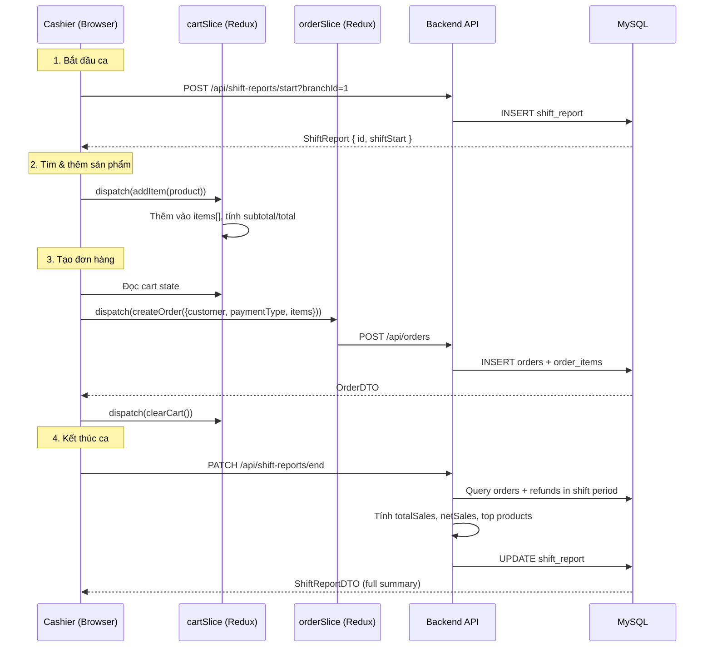

# 📖 PHẦN 3: FRONTEND CHI TIẾT — REDUX, ROUTING, COMPONENTS

---

## 12. CẤU TRÚC THƯ MỤC FRONTEND

```
pos-frontend-vite/
├── public/                    # Static assets
├── src/
│   ├── App.jsx                # Entry point — routing + auth guard
│   ├── main.jsx               # ReactDOM.render + Redux Provider
│   ├── index.css              # Tailwind CSS imports
│   │
│   ├── components/            # Reusable UI components
│   │   └── ui/                # 48 shadcn/ui components
│   │       ├── button.jsx     # Button với variants
│   │       ├── dialog.jsx     # Modal dialog
│   │       ├── table.jsx      # Data table
│   │       ├── input.jsx      # Text input
│   │       ├── select.jsx     # Dropdown select
│   │       ├── toast.jsx      # Notification toast
│   │       └── ... (48 files)
│   │
│   ├── pages/                 # Page components theo vai trò
│   │   ├── SuperAdmin/        # Dashboard, Store Management
│   │   ├── StoreAdmin/        # Store dashboard, branches, products
│   │   ├── BranchAdmin/       # Branch dashboard, orders, inventory
│   │   ├── Cashier/           # POS interface, shift management
│   │   └── Auth/              # Login, Register, Reset Password
│   │
│   ├── Redux Toolkit/         # State management
│   │   ├── features/          # 22 feature slices
│   │   │   ├── auth/          # authSlice + authThunks
│   │   │   ├── store/         # storeSlice + storeThunks
│   │   │   ├── branch/        # branchSlice + branchThunks
│   │   │   ├── product/       # productSlice + productThunks
│   │   │   ├── order/         # orderSlice + orderThunks
│   │   │   ├── cart/          # cartSlice (local state, no API)
│   │   │   ├── shift/         # shiftSlice + shiftThunks
│   │   │   ├── refund/        # refundSlice + refundThunks
│   │   │   ├── inventory/     # inventorySlice + inventoryThunks
│   │   │   ├── category/      # categorySlice + categoryThunks
│   │   │   ├── customer/      # customerSlice + customerThunks
│   │   │   ├── employee/      # employeeSlice + employeeThunks
│   │   │   ├── subscription/  # subscriptionSlice + subscriptionThunks
│   │   │   ├── analytics/     # analyticsSlice + analyticsThunks
│   │   │   └── ...
│   │   └── globleState.js     # combineReducers — gộp 22 slices
│   │
│   ├── routes/                # Route definitions
│   │   ├── SuperAdminRoutes.jsx
│   │   ├── StoreAdminRoutes.jsx
│   │   ├── BranchManagerRoutes.jsx
│   │   ├── CashierRoutes.jsx
│   │   └── AuthRoutes.jsx
│   │
│   └── utils/
│       ├── api.js             # Axios instance (baseURL: localhost:5000)
│       ├── uploadToCloudinary.js
│       └── roleUtils.js       # Kiểm tra role
│
├── vite.config.js             # Vite config + alias @/ → src/
├── tailwind.config.js
└── package.json
```

---

## 13. REDUX TOOLKIT — QUẢN LÝ STATE

### 13.1 Redux là gì? (cho người mới)

Redux là "kho dữ liệu trung tâm" của ứng dụng. Thay vì mỗi component tự giữ data, tất cả được lưu ở 1 nơi → mọi component đều truy cập được.

```
Component dispatch action → Reducer xử lý → State thay đổi → UI re-render
```

### 13.2 Cấu trúc mỗi feature slice

Mỗi feature gồm 2 file:
- **Slice** (`xxxSlice.js`): Định nghĩa state ban đầu + reducers + xử lý async
- **Thunks** (`xxxThunks.js`): Các hàm async gọi API (createAsyncThunk)

### 13.3 Chi tiết 22 Slices

#### 📌 `authSlice` — Xác thực

```javascript
// State
{
  user: null,         // User object sau khi login
  jwt: null,          // JWT token
  loading: false,
  error: null
}

// Thunks (gọi API)
login({email, password})      → POST /auth/login
signup({fullName, email...})  → POST /auth/signup
getUserProfile(jwt)           → GET /api/users/profile
forgotPassword(email)         → POST /auth/forgot-password
resetPassword({token, pass})  → POST /auth/reset-password
logout()                      → Xóa localStorage + reset state
```

#### 📌 `storeSlice` — Cửa hàng

```javascript
// State
{
  store: null,        // Store hiện tại
  stores: [],         // Danh sách stores (Super Admin)
  employees: [],      // Nhân viên của store
  loading: false
}

// Thunks
createStore(storeDto)           → POST /api/stores
getStoreByAdmin()               → GET /api/stores/admin
getStoreByEmployee()            → GET /api/stores/employee
updateStore({id, storeDto})     → PUT /api/stores/{id}
deleteStore()                   → DELETE /api/stores
getAllStores(status)             → GET /api/stores?status=
moderateStore({storeId, action}) → PUT /api/stores/{id}/moderate
addEmployee(userDto)            → POST /api/stores/add/employee
getEmployeesByStore(storeId)    → GET /api/stores/{id}/employee/list
```

#### 📌 `branchSlice` — Chi nhánh

```javascript
// State
{ branch: null, branches: [], loading: false }

// Thunks
createBranch(dto)                → POST /api/branches
getBranchById(id)                → GET /api/branches/{id}
getAllBranchesByStore(storeId)    → GET /api/branches/store/{storeId}
updateBranch({id, dto})          → PUT /api/branches/{id}
deleteBranch(id)                 → DELETE /api/branches/{id}
```

#### 📌 `productSlice` — Sản phẩm

```javascript
// State
{ product: null, products: [], searchResults: [], loading: false }

// Thunks
createProduct(dto)               → POST /api/products
getProductById(id)               → GET /api/products/{id}
updateProduct({id, dto})         → PATCH /api/products/{id}
deleteProduct(id)                → DELETE /api/products/{id}
getProductsByStore(storeId)      → GET /api/products/store/{storeId}
searchProducts({storeId, q})     → GET /api/products/store/{storeId}/search?q=
```

#### 📌 `orderSlice` — Đơn hàng

```javascript
// State
{ order: null, orders: [], todayOrders: [], recentOrders: [], loading: false }

// Thunks
createOrder(dto)                     → POST /api/orders
getOrderById(id)                     → GET /api/orders/{id}
getOrdersByBranch({branchId, ...})   → GET /api/orders/branch/{id}?...
getOrdersByCashier(cashierId)        → GET /api/orders/cashier/{id}
getTodayOrders(branchId)             → GET /api/orders/today/branch/{id}
getRecentOrders(branchId)            → GET /api/orders/recent/{id}
getOrdersByCustomer(customerId)      → GET /api/orders/customer/{id}
deleteOrder(id)                      → DELETE /api/orders/{id}
```

#### 📌 `cartSlice` — Giỏ hàng POS (KHÔNG GỌI API — chỉ local state)

```javascript
// State
{
  items: [],              // Sản phẩm trong giỏ
  discount: 0,            // Giảm giá (%)
  taxRate: 0,             // Thuế (%)
  customer: null,         // Khách hàng
  paymentMethod: 'CASH',  // Phương thức thanh toán
  holdOrders: [],         // Đơn hàng tạm giữ
  
  // Tính toán tự động:
  subtotal: 0,            // Tổng trước giảm giá
  discountAmount: 0,      // Số tiền giảm
  taxAmount: 0,           // Thuế
  total: 0                // Tổng thanh toán
}

// Reducers (local, không gọi API)
addItem(product)          // Thêm sản phẩm → nếu đã có thì tăng quantity
removeItem(productId)     // Xóa sản phẩm
updateQuantity({id, qty}) // Cập nhật số lượng
setDiscount(percent)      // Đặt giảm giá
setTaxRate(percent)       // Đặt thuế
setCustomer(customer)     // Gán khách hàng
setPaymentMethod(method)  // Đặt phương thức thanh toán
holdOrder()               // Tạm giữ đơn hiện tại
restoreOrder(index)       // Khôi phục đơn tạm giữ
clearCart()               // Xóa toàn bộ giỏ

// Tính toán trong reducer:
// subtotal = SUM(item.sellingPrice × item.quantity)
// discountAmount = subtotal × (discount / 100)
// taxAmount = (subtotal - discountAmount) × (taxRate / 100)
// total = subtotal - discountAmount + taxAmount
```

#### 📌 `shiftSlice` — Ca làm việc

```javascript
// State
{ currentShift: null, shifts: [], loading: false }

// Thunks
startShift(branchId)                → POST /api/shift-reports/start?branchId=
endShift()                          → PATCH /api/shift-reports/end
getCurrentShift()                   → GET /api/shift-reports/current
getShiftsByCashier(cashierId)       → GET /api/shift-reports/cashier/{id}
getShiftsByBranch(branchId)         → GET /api/shift-reports/branch/{id}
getShiftById(id)                    → GET /api/shift-reports/{id}
```

#### 📌 `refundSlice` — Hoàn trả

```javascript
// Thunks
createRefund(dto)                   → POST /api/refunds
getAllRefunds()                      → GET /api/refunds
getRefundsByBranch(branchId)        → GET /api/refunds/branch/{id}
getRefundsByCashier(cashierId)      → GET /api/refunds/cashier/{id}
getRefundById(id)                   → GET /api/refunds/{id}
```

#### 📌 Các slice khác tương tự pattern: `inventorySlice`, `categorySlice`, `customerSlice`, `employeeSlice`, `subscriptionSlice`, `analyticsSlice`

---

## 14. ROUTING — ĐIỀU HƯỚNG THEO VAI TRÒ

### 14.1 Cách hoạt động

> File: [App.jsx](file:///Users/Study/DOAN/z%20pos-source-code_1/pos-frontend-vite/src/App.jsx)

```
1. Khi mở app → kiểm tra localStorage có JWT không
2. Nếu có JWT → gọi getUserProfile() để lấy thông tin user
3. Dựa vào user.role → render route tương ứng:
   - ROLE_ADMIN          → SuperAdminRoutes
   - ROLE_STORE_ADMIN    → StoreAdminRoutes
   - ROLE_STORE_MANAGER  → StoreAdminRoutes
   - ROLE_BRANCH_MANAGER → BranchManagerRoutes
   - ROLE_BRANCH_ADMIN   → BranchManagerRoutes
   - ROLE_BRANCH_CASHIER → CashierRoutes
4. Nếu không có JWT → AuthRoutes (login/register)
```

### 14.2 Chi tiết Routes

#### Super Admin (`/super-admin/*`)
```
/super-admin/dashboard        → Tổng quan: tổng stores, pending, active, blocked
/super-admin/stores            → Danh sách stores + approve/block
/super-admin/subscription-plans → Quản lý gói dịch vụ
```

#### Store Admin (`/store/*`)
```
/store/dashboard               → Tổng quan store: doanh thu, branches, employees
/store/branches                → Danh sách chi nhánh + tạo mới
/store/products                → Danh sách sản phẩm + CRUD
/store/categories              → Quản lý danh mục
/store/employees               → Quản lý nhân viên
/store/subscriptions           → Quản lý gói đăng ký + nâng cấp
/store/analytics               → Báo cáo: monthly sales, category, branch, payment
/store/settings                → Cài đặt cửa hàng (brand, contact)
```

#### Branch Manager (`/branch/*`)
```
/branch/dashboard              → Tổng quan chi nhánh: doanh thu hôm nay, growth
/branch/orders                 → Danh sách đơn hàng + filter
/branch/inventory              → Tồn kho sản phẩm
/branch/employees              → Nhân viên chi nhánh
/branch/shifts                 → Danh sách ca làm việc
/branch/analytics              → Biểu đồ: daily sales, top products, cashiers
```

#### Cashier (`/cashier/*`)
```
/cashier/pos                   → 🔥 Giao diện bán hàng chính
/cashier/shift                 → Quản lý ca: start/end, tiến độ real-time
/cashier/orders                → Lịch sử đơn hàng đã tạo
/cashier/refunds               → Tạo hoàn trả
```

---

## 15. LUỒNG BÁN HÀNG (POS) — QUAN TRỌNG NHẤT



---

## 16. UTILS — TIỆN ÍCH

### 16.1 `api.js` — Axios Instance
```javascript
import axios from 'axios';
const api = axios.create({
  baseURL: 'http://localhost:5000',
});
// Tự động thêm JWT vào mọi request
api.interceptors.request.use((config) => {
  const jwt = localStorage.getItem('jwt');
  if (jwt) config.headers.Authorization = `Bearer ${jwt}`;
  return config;
});
```

### 16.2 `uploadToCloudinary.js` — Upload ảnh
```javascript
// Upload ảnh trực tiếp từ frontend → Cloudinary (không qua backend)
// Trả về URL ảnh để lưu vào product.image
```

---

## 17. COMPONENT UI (shadcn/ui)

48 components sẵn dùng, quan trọng nhất:

| Component | Dùng ở đâu |
|-----------|------------|
| `Button` | Mọi nơi (submit form, actions) |
| `Dialog` | Popup tạo/sửa (branch, product, employee) |
| `Table` | Danh sách orders, products, employees |
| `Input` | Form fields |
| `Select` | Dropdown (role, category, paymentType) |
| `Card` | Dashboard cards (doanh thu, orders) |
| `Tabs` | Chuyển tab trong dashboard |
| `Toast` | Thông báo thành công/lỗi |
| `Badge` | Status labels (Active, Pending) |
| `Sidebar` | Menu bên trái |
| `Chart (Recharts)` | Biểu đồ doanh thu, sản phẩm |

---

## 18. LUỒNG DỮ LIỆU TỔNG HỢP

```
User click "Tạo đơn hàng"
  ↓
React Component: PosPage.jsx
  ↓
dispatch(createOrder(cartData))
  ↓
orderThunks.js: createOrder = createAsyncThunk(...)
  ↓
api.post("/api/orders", dto, { headers: { Authorization: Bearer JWT }})
  ↓
JwtValidator.java: parse JWT → set SecurityContext
  ↓
OrderController.java: @PostMapping → orderService.createOrder(dto)
  ↓
OrderServiceImpl.java:
  1. getCurrentUser() → lấy cashier từ SecurityContext
  2. cashier.getBranch() → lấy branch
  3. Map items → resolve Products → tính price
  4. orderRepository.save(order) → INSERT SQL
  ↓
MySQL: INSERT INTO orders, INSERT INTO order_items
  ↓
OrderMapper.toDto(order) → OrderDTO
  ↓
JSON response → Axios → Redux extraReducers (fulfilled)
  ↓
orderSlice state cập nhật
  ↓
React component re-render → hiển thị đơn hàng mới
```
