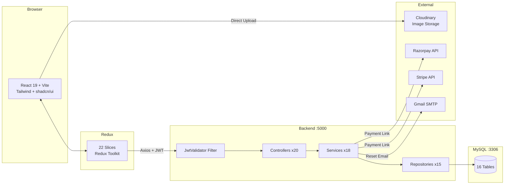
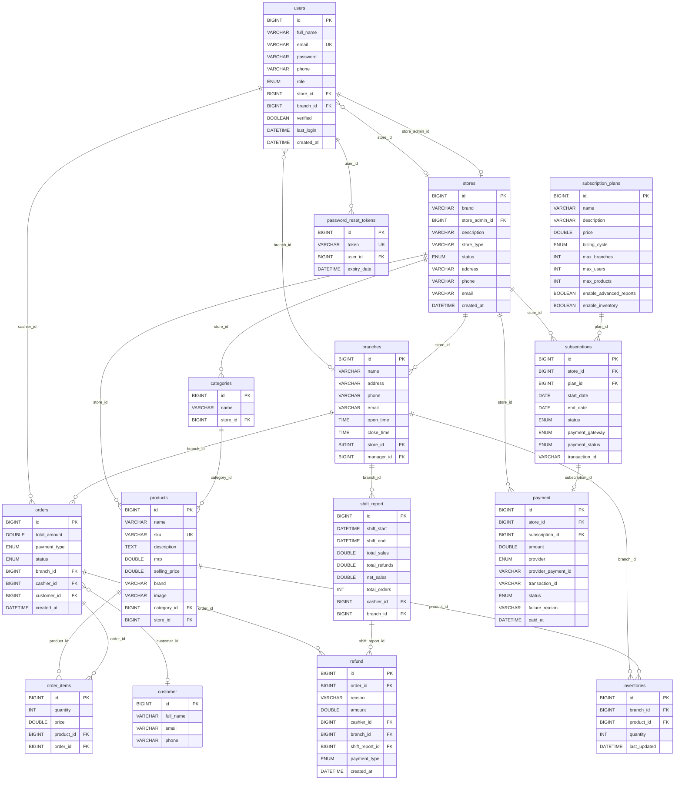

# TÀI LIỆU KỸ THUẬT — ZOSH POS
## Hệ thống Quản lý Điểm bán hàng Đa chi nhánh

**Phiên bản:** 1.0 | **Ngôn ngữ:** Tiếng Việt | **Cập nhật:** 2024

---

## MỤC LỤC

- [1. Giới thiệu & Tổng quan](#1-gioi-thieu)
- [2. Kiến trúc Frontend (React)](#2-frontend)
- [3. Kiến trúc Backend (Java Spring Boot)](#3-backend)
- [4. Mô hình Dữ liệu & Database](#4-database)
- [Phần 2 → TECHNICAL_DOCS_PART2.md]

---

## 1. GIỚI THIỆU & TỔNG QUAN

### 1.1 Tóm tắt kiến trúc (3–5 câu)

Zosh POS là hệ thống **SaaS multi-tenant** (nhiều khách thuê một nền tảng) cho phép nhiều chuỗi bán lẻ đăng ký và vận hành độc lập. Frontend xây dựng bằng **React 19 + Vite + Redux Toolkit**, giao tiếp với **Spring Boot 3.5.3** qua REST API bảo mật JWT. Backend áp dụng kiến trúc phân tầng chuẩn: Controller → Service → Repository → MySQL, với phân quyền 7 cấp từ Super Admin đến Cashier. Tích hợp bên ngoài gồm **Cloudinary** (lưu ảnh), **Razorpay/Stripe** (thanh toán gói SaaS), và **Gmail SMTP** (email thông báo).

### 1.2 Bài toán giải quyết

| Vấn đề thực tế | Giải pháp hệ thống |
|---|---|
| Quản lý kho thủ công, sai sót | Tồn kho tự động theo chi nhánh (`inventories`) |
| Không đồng bộ giữa chi nhánh | Dữ liệu tập trung, phân tách logic theo `store_id`/`branch_id` |
| Thiếu báo cáo thời gian thực | Analytics API tính toán theo ngày/tuần/tháng |
| Ca làm việc không minh bạch | Shift Report chốt sổ tự động khi kết ca |
| Khó quản lý nhiều cửa hàng | Super Admin duyệt và giám sát toàn hệ thống |

### 1.3 Đối tượng người dùng & phân quyền

```
ROLE_ADMIN           → Super Admin     → Duyệt cửa hàng, quản lý gói SaaS
ROLE_STORE_ADMIN     → Chủ cửa hàng   → Tạo branch, sản phẩm, nhân viên
ROLE_STORE_MANAGER   → Quản lý Store  → Tương tự Store Admin, không phải chủ
ROLE_BRANCH_MANAGER  → Quản lý CN     → Orders, inventory, employees của CN
ROLE_BRANCH_ADMIN    → Admin CN       → Tương tự Branch Manager
ROLE_BRANCH_CASHIER  → Thu ngân       → Bán hàng, tạo đơn, mở/đóng ca
ROLE_CUSTOMER        → Khách hàng     → Ghi nhận thông tin, xem lịch sử
```

### 1.4 Sơ đồ kiến trúc tổng thể



### 1.5 Tech Stack chi tiết

**Frontend**
| Thư viện | Phiên bản | Vai trò |
|---|---|---|
| React | 19 | UI framework |
| Vite | 7 | Build tool, dev server |
| Redux Toolkit | latest | State management (22 slices) |
| React Router | v7 | Client-side routing |
| Tailwind CSS | v4 | Utility-first CSS |
| shadcn/ui (Radix) | latest | 48 UI components |
| Axios | latest | HTTP client |
| Recharts | latest | Dashboard charts |
| Zod / react-hook-form | latest | Form validation |

**Backend**
| Thư viện | Phiên bản | Vai trò |
|---|---|---|
| Spring Boot | 3.5.3 | Application framework |
| Spring Security | 6.x | Auth + authorization |
| Spring Data JPA | 3.x | ORM layer |
| MySQL Connector | 8.x | JDBC driver |
| JJWT | 0.12.6 | JWT generation/parsing |
| Lombok | latest | Boilerplate reduction |
| Razorpay Java SDK | 1.4.8 | Payment gateway |
| Stripe Java SDK | 28.3.1 | Payment gateway |
| Spring Mail | 3.x | Email sending |

---

## 2. KIẾN TRÚC FRONTEND (REACT)

### 2.1 Cấu trúc thư mục

```
pos-frontend-vite/
├── src/
│   ├── App.jsx                      # Root: routing + auth guard
│   ├── main.jsx                     # ReactDOM entry + Redux Provider
│   │
│   ├── components/ui/               # 48 shadcn/ui components
│   │   ├── button.jsx, input.jsx, dialog.jsx, table.jsx
│   │   ├── select.jsx, toast.jsx, card.jsx, badge.jsx
│   │   ├── sidebar.jsx, tabs.jsx, sheet.jsx, ...
│   │
│   ├── pages/                       # Route-level page components
│   │   ├── Auth/                    # Login, Register, ResetPassword
│   │   ├── SuperAdmin/              # Dashboard, StoreList
│   │   ├── StoreAdmin/              # Dashboard, Branches, Products, Analytics
│   │   ├── BranchManager/           # Dashboard, Orders, Inventory, Shifts
│   │   └── Cashier/                 # POS Interface, ShiftManagement
│   │
│   ├── Redux Toolkit/
│   │   ├── features/                # 22 feature slices
│   │   │   ├── auth/authSlice.js + authThunks.js
│   │   │   ├── store/storeSlice.js + storeThunks.js
│   │   │   ├── branch/branchSlice.js + branchThunks.js
│   │   │   ├── product/productSlice.js + productThunks.js
│   │   │   ├── order/orderSlice.js + orderThunks.js
│   │   │   ├── cart/cartSlice.js           # Local only, no API
│   │   │   ├── shift/shiftSlice.js + shiftThunks.js
│   │   │   ├── refund/refundSlice.js + refundThunks.js
│   │   │   ├── inventory/inventorySlice.js + inventoryThunks.js
│   │   │   ├── category/categorySlice.js + categoryThunks.js
│   │   │   ├── customer/customerSlice.js + customerThunks.js
│   │   │   ├── employee/employeeSlice.js + employeeThunks.js
│   │   │   ├── subscription/...
│   │   │   └── analytics/...
│   │   └── globleState.js           # combineReducers (22 slices)
│   │
│   └── utils/
│       ├── api.js                   # Axios instance (baseURL: :5000)
│       └── uploadToCloudinary.js    # Direct image upload
│
├── vite.config.js                   # alias @/ → src/
└── package.json
```

### 2.2 Redux Store — Cấu trúc & Luồng

```
Người dùng click
      ↓
React Component dispatch(action)
      ↓
Async Thunk (createAsyncThunk)
      ↓
Axios → API Backend (với JWT header)
      ↓
Response → extraReducers: fulfilled / rejected
      ↓
State cập nhật → Component re-render
```

**Cấu trúc mỗi Slice:**
```javascript
// authSlice.js — mẫu điển hình
{
  initialState: {
    user: null,      // Object User sau khi login
    jwt: null,       // Token string
    loading: false,
    error: null
  },
  reducers: { logout() },
  extraReducers: {
    login.pending  → loading: true
    login.fulfilled → user + jwt + localStorage.setItem("jwt")
    login.rejected  → error: message
  }
}
```

**22 Slices và mục đích:**
| Slice | State chính | Gọi API |
|---|---|---|
| `authSlice` | user, jwt | /auth/* |
| `storeSlice` | store, stores, employees | /api/stores/* |
| `branchSlice` | branch, branches | /api/branches/* |
| `productSlice` | product, products, searchResults | /api/products/* |
| `orderSlice` | order, orders, todayOrders | /api/orders/* |
| `cartSlice` | items, discount, tax, holdOrders | ❌ (local only) |
| `shiftSlice` | currentShift, shifts | /api/shift-reports/* |
| `refundSlice` | refunds | /api/refunds/* |
| `inventorySlice` | inventories | /api/inventories/* |
| `categorySlice` | categories | /api/categories/* |
| `customerSlice` | customers | /api/customers/* |
| `employeeSlice` | employees | /api/employees/* |
| `subscriptionSlice` | subscriptions | /api/subscriptions/* |
| `analyticsSlice` | various analytics | /api/branch-analytics/* + /api/store/analytics/* |

### 2.3 Routing theo vai trò

**File:** `App.jsx`
```
JWT trong localStorage?
  ├── Không → AuthRoutes (Login/Register)
  └── Có → getUserProfile() để lấy role
               ├── ROLE_ADMIN         → /super-admin/*
               ├── ROLE_STORE_ADMIN   → /store/*
               ├── ROLE_STORE_MANAGER → /store/*
               ├── ROLE_BRANCH_*      → /branch/*
               └── ROLE_BRANCH_CASHIER → /cashier/*
```

**Chi tiết routes từng role:**
```
/super-admin/dashboard       → Tổng stores active/pending/blocked
/super-admin/stores          → Danh sách + approve/block

/store/dashboard             → KPI cửa hàng
/store/branches              → CRUD chi nhánh
/store/products              → CRUD sản phẩm
/store/categories            → CRUD danh mục
/store/employees             → Quản lý nhân viên
/store/subscriptions         → Gói dịch vụ + thanh toán
/store/analytics             → Biểu đồ doanh thu

/branch/dashboard            → KPI chi nhánh (today vs yesterday)
/branch/orders               → Danh sách đơn hàng + bộ lọc
/branch/inventory            → Tồn kho sản phẩm
/branch/employees            → Nhân viên chi nhánh
/branch/shifts               → Ca làm việc
/branch/analytics            → Daily sales, top products, cashiers

/cashier/pos                 → 🔥 Giao diện bán hàng chính
/cashier/shift               → Mở ca / Kết ca / Tiến độ realtime
/cashier/orders              → Lịch sử đơn hàng
/cashier/refunds             → Tạo hoàn trả
```

### 2.4 cartSlice.js — Logic Giỏ hàng (Không gọi API)

Đây là slice quan trọng nhất về mặt UX — toàn bộ tính tiền xảy ra tại client để đảm bảo realtime:

```javascript
// State shape
{
  items: [{ id, name, sellingPrice, quantity, image }],
  discount: 0,          // %
  taxRate: 0,           // %
  customer: null,
  paymentMethod: 'CASH',
  holdOrders: [],       // Mảng các giỏ hàng tạm giữ
  
  // Computed (auto recalculate)
  subtotal: 0,          // SUM(sellingPrice × quantity)
  discountAmount: 0,    // subtotal × (discount/100)
  taxAmount: 0,         // (subtotal - discountAmount) × (taxRate/100)
  total: 0              // subtotal - discountAmount + taxAmount
}

// Key Reducers
addItem(product)         → nếu đã có: qty++, else: push
removeItem(productId)    → filter ra
updateQuantity({id,qty}) → map cập nhật qty
setDiscount(%)          → recalculate discountAmount
setTaxRate(%)           → recalculate taxAmount
holdOrder()             → push items vào holdOrders, clearCart
restoreOrder(index)     → kéo ra từ holdOrders, đưa vào items
clearCart()             → reset về initial state
```

---

## 3. KIẾN TRÚC BACKEND (JAVA SPRING BOOT)

### 3.1 Kiến trúc phân tầng

```
HTTP Request
    ↓
JwtValidator (Filter)     ← parse JWT, set SecurityContext
    ↓
GlobalExceptionHandler    ← bắt toàn bộ exception
    ↓
Controller (20 classes)   ← @RestController, @PreAuthorize
    ↓
Service (18 classes)      ← business logic, getCurrentUser()
    ↓
Repository (15 interfaces) ← JPA queries, native SQL
    ↓
Entity/Model (16 classes)  ← @Entity, JPA annotations
    ↓
MySQL Database
```

### 3.2 Cấu trúc package

```
com.zosh/
├── configrations/
│   ├── SecurityConfig.java      # Filter chain, CORS, path rules
│   ├── JwtProvider.java         # generateToken(), getEmail()
│   ├── JwtValidator.java        # OncePerRequestFilter
│   └── JwtConstant.java         # SECRET_KEY, expiry
│
├── controller/ (20 files)
│   ├── AuthController.java
│   ├── StoreController.java, BranchController.java
│   ├── ProductController.java, CategoryController.java
│   ├── OrderController.java, OrderItemController.java
│   ├── CustomerController.java, EmployeeController.java
│   ├── InventoryController.java, RefundController.java
│   ├── ShiftReportController.java, UserController.java
│   ├── SubscriptionController.java, SubscriptionPlanController.java
│   ├── PaymentController.java
│   ├── BranchAnalyticsController.java, StoreAnalyticsController.java
│   ├── AdminDashboardController.java, HomeController.java
│
├── service/impl/ (18 files)
│   ├── AuthServiceImpl.java, UserServiceImpl.java
│   ├── StoreServiceImpl.java, BranchServiceImpl.java
│   ├── ProductServiceImpl.java, CategoryServiceImpl.java
│   ├── OrderServiceImpl.java, OrderItemServiceImpl.java
│   ├── CustomerServiceImpl.java, EmployeeServiceImpl.java
│   ├── InventoryServiceImpl.java, RefundServiceImpl.java
│   ├── ShiftReportServiceImpl.java
│   ├── SubscriptionServiceImpl.java, PaymentServiceImpl.java
│   ├── BranchAnalyticsServiceImpl.java, StoreAnalyticsServiceImpl.java
│   ├── AdminDashboardServiceImpl.java
│   └── DataInitializationComponent.java   # Tạo Super Admin khi startup
│
├── service/gateway/
│   ├── RazorpayService.java     # Tạo payment link, verify
│   └── StripeService.java       # Stripe integration (demo mode)
│
├── repository/ (15 interfaces)  # extends JpaRepository<Entity, Long>
├── modal/ (16 entities)         # @Entity JPA classes
├── mapper/ (12 classes)         # Entity → DTO conversion
├── payload/dto/                 # 30+ DTO classes
├── payload/request/             # Request body objects
├── payload/response/            # Response wrappers
├── exception/
│   ├── GlobalExceptionHandler.java
│   ├── UserException.java, ResourceNotFoundException.java
│   ├── AccessDeniedException.java, PaymentException.java
├── event/ + event/publisher/    # Spring Events cho Payment
└── domain/                      # 10 Enum definitions
```

### 3.3 Security Configuration

**Đường dẫn public (không cần JWT):**
```
/auth/**          → Login, signup, forgot/reset password
GET /             → HomeController
```

**Đường dẫn bảo vệ:**
```
/api/super-admin/** → hasRole("ADMIN") only
/api/**            → authenticated (bất kỳ role nào)
```

**CORS origins được phép:**
```
http://localhost:3000
http://localhost:5173
https://zosh-pos.vercel.app
https://pos-sytem-bcs6.vercel.app
```

---

## 4. MÔ HÌNH DỮ LIỆU & DATABASE

### 4.1 ERD — Sơ đồ quan hệ thực thể



### 4.2 Enums (domain values)

| Enum | Values |
|---|---|
| `UserRole` | ROLE_ADMIN, ROLE_STORE_ADMIN, ROLE_STORE_MANAGER, ROLE_BRANCH_MANAGER, ROLE_BRANCH_ADMIN, ROLE_BRANCH_CASHIER, ROLE_CUSTOMER |
| `StoreStatus` | PENDING, ACTIVE, BLOCKED |
| `OrderStatus` | COMPLETED, PENDING, REFUNDED, CANCELLED |
| `PaymentType` | CASH, CARD, UPI |
| `PaymentStatus` | PENDING, SUCCESS, FAILED |
| `PaymentGateway` | RAZORPAY, STRIPE |
| `SubscriptionStatus` | TRIAL, ACTIVE, EXPIRED, CANCELLED |
| `BillingCycle` | MONTHLY, YEARLY |

---
**→ Tiếp theo: [TECHNICAL_DOCS_PART2.md] — Luồng nghiệp vụ, API endpoints, hướng dẫn onboard**
