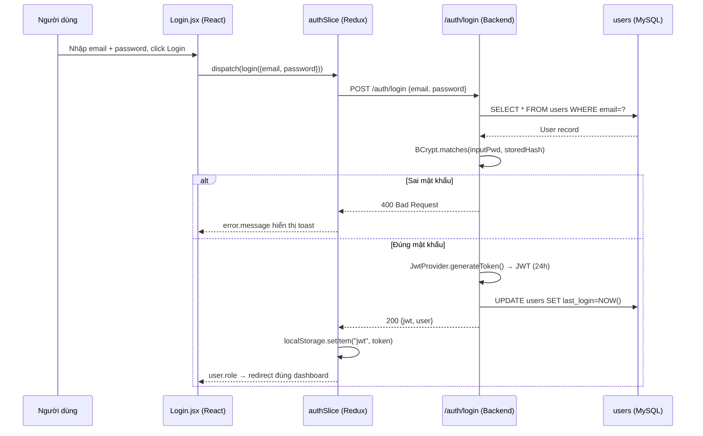
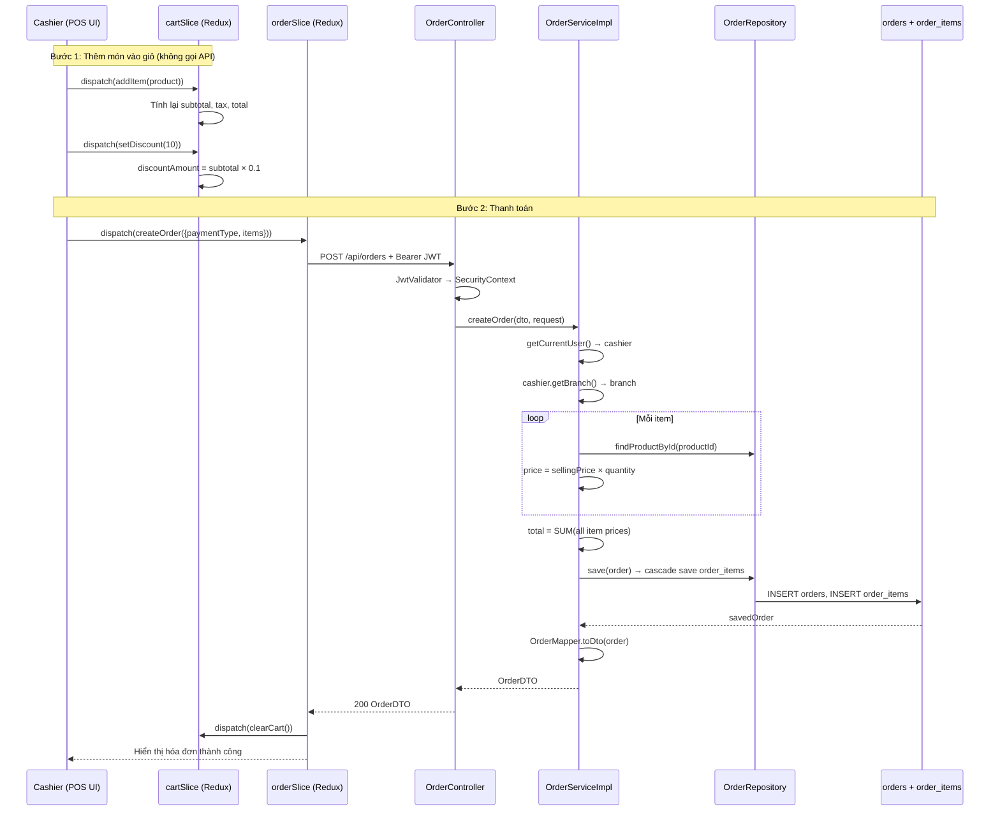
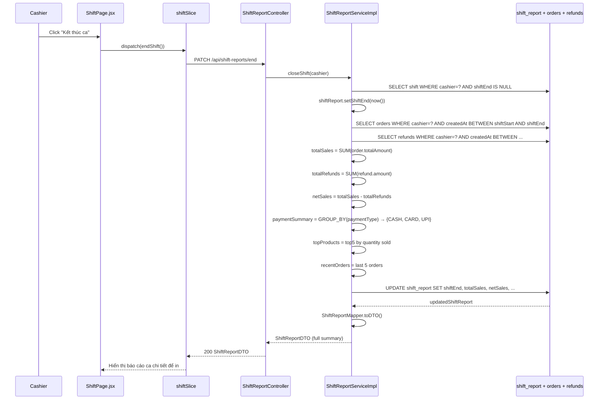
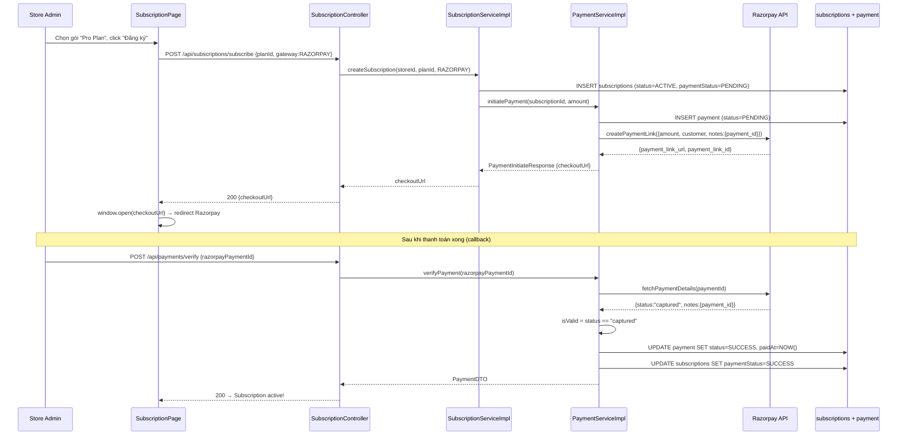
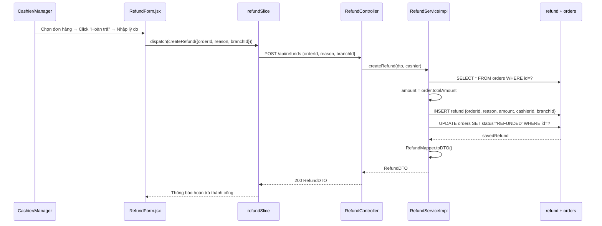

# TÀI LIỆU KỸ THUẬT ZOSH POS — PHẦN 2
## API Endpoints, Luồng Nghiệp Vụ, Hướng Dẫn Onboard

---

## 5. TOÀN BỘ API ENDPOINTS

### 5.1 Auth — `/auth/**`

| Method | Path | Auth | Mô tả |
|---|---|---|---|
| POST | `/auth/signup` | Public | Đăng ký tài khoản Store Admin |
| POST | `/auth/login` | Public | Đăng nhập, nhận JWT |
| POST | `/auth/forgot-password` | Public | Gửi email reset mật khẩu |
| POST | `/auth/reset-password` | Public | Đặt lại mật khẩu bằng token |

**Request/Response Login:**
```json
// POST /auth/login
Request: { "email": "user@example.com", "password": "123456" }
Response: { "jwt": "eyJ...", "user": { "id":1, "role":"ROLE_STORE_ADMIN", ... } }
```

### 5.2 User — `/api/users/**`

| Method | Path | Mô tả |
|---|---|---|
| GET | `/api/users/profile` | Lấy profile từ JWT (dùng khi reload trang) |
| GET | `/api/users/customer` | Danh sách user role CUSTOMER |
| GET | `/api/users/cashier` | Danh sách user role CASHIER |
| GET | `/users/list` | Toàn bộ users |
| GET | `/users/{id}` | User theo ID |

### 5.3 Store — `/api/stores/**`

| Method | Path | Auth | Mô tả |
|---|---|---|---|
| POST | `/api/stores` | JWT | Tạo cửa hàng (status=PENDING) |
| GET | `/api/stores` | JWT | Lấy danh sách (filter by status) |
| GET | `/api/stores/{id}` | JWT | Chi tiết cửa hàng |
| PUT | `/api/stores/{id}` | JWT | Cập nhật thông tin |
| DELETE | `/api/stores` | JWT | Xóa cửa hàng của user hiện tại |
| GET | `/api/stores/admin` | JWT | Store của user hiện tại (Store Admin) |
| GET | `/api/stores/employee` | JWT | Store mà user đang làm việc |
| GET | `/api/stores/{id}/employee/list` | STORE_ADMIN | Danh sách nhân viên |
| POST | `/api/stores/add/employee` | STORE_ADMIN | Tạo tài khoản nhân viên |
| PUT | `/api/stores/{id}/moderate` | ROLE_ADMIN | Approve/Block store |

### 5.4 Branch — `/api/branches/**`

| Method | Path | Mô tả |
|---|---|---|
| POST | `/api/branches` | Tạo chi nhánh |
| GET | `/api/branches/{id}` | Chi tiết chi nhánh |
| GET | `/api/branches/store/{storeId}` | Danh sách chi nhánh của store |
| PUT | `/api/branches/{id}` | Cập nhật chi nhánh |
| DELETE | `/api/branches/{id}` | Xóa chi nhánh |

### 5.5 Product — `/api/products/**`

| Method | Path | Mô tả |
|---|---|---|
| POST | `/api/products` | Tạo sản phẩm (kiểm tra quyền store) |
| GET | `/api/products/{id}` | Chi tiết sản phẩm |
| PATCH | `/api/products/{id}` | Cập nhật sản phẩm |
| DELETE | `/api/products/{id}` | Xóa sản phẩm |
| GET | `/api/products/store/{storeId}` | Sản phẩm của store |
| GET | `/api/products/store/{storeId}/search?q=` | Tìm kiếm theo tên/SKU |

### 5.6 Order — `/api/orders/**`

| Method | Path | Auth | Mô tả |
|---|---|---|---|
| POST | `/api/orders` | CASHIER | Tạo đơn hàng |
| GET | `/api/orders/{id}` | JWT | Chi tiết đơn |
| GET | `/api/orders/branch/{branchId}` | JWT | Đơn theo chi nhánh |
| GET | `/api/orders/cashier/{cashierId}` | JWT | Đơn của thu ngân |
| GET | `/api/orders/today/branch/{branchId}` | JWT | Đơn hôm nay |
| GET | `/api/orders/customer/{customerId}` | JWT | Đơn của khách |
| GET | `/api/orders/recent/{branchId}` | BRANCH_MANAGER | 5 đơn gần nhất |
| DELETE | `/api/orders/{id}` | STORE_ADMIN | Xóa đơn |

**Request Tạo đơn hàng:**
```json
POST /api/orders
{
  "customer": { "fullName": "Nguyễn Văn A", "phone": "0901234567" },
  "paymentType": "CASH",
  "items": [
    { "productId": 1, "quantity": 2 },
    { "productId": 3, "quantity": 1 }
  ]
}
```

### 5.7 Shift Report — `/api/shift-reports/**`

| Method | Path | Mô tả |
|---|---|---|
| POST | `/api/shift-reports/start?branchId=` | Bắt đầu ca |
| PATCH | `/api/shift-reports/end` | Kết thúc ca, chốt sổ |
| GET | `/api/shift-reports/current` | Tiến độ ca hiện tại (realtime) |
| GET | `/api/shift-reports/cashier/{id}` | Tất cả ca của cashier |
| GET | `/api/shift-reports/branch/{id}` | Tất cả ca của branch |
| GET | `/api/shift-reports/{id}` | Chi tiết ca |
| DELETE | `/api/shift-reports/{id}` | Xóa ca |

### 5.8 Refund — `/api/refunds/**`

| Method | Path | Mô tả |
|---|---|---|
| POST | `/api/refunds` | Tạo hoàn trả |
| GET | `/api/refunds` | Tất cả refunds |
| GET | `/api/refunds/{id}` | Chi tiết refund |
| GET | `/api/refunds/branch/{id}` | Refunds theo branch |
| GET | `/api/refunds/cashier/{id}` | Refunds của cashier |

### 5.9 Analytics

**Branch Analytics — `/api/branch-analytics/**`**

| Path | Mô tả |
|---|---|
| `GET /daily-sales?branchId=&days=7` | Doanh thu N ngày gần nhất |
| `GET /top-products?branchId=` | Top 5 sản phẩm bán chạy + % |
| `GET /top-cashiers?branchId=` | Top 5 thu ngân theo doanh thu |
| `GET /category-sales?branchId=&date=` | Phân tích theo danh mục |
| `GET /today-overview?branchId=` | KPIs hôm nay vs hôm qua |
| `GET /payment-breakdown?branchId=&date=` | Phân tích phương thức TT |

**Store Analytics — `/api/store/analytics/{storeAdminId}/**`**

| Path | Mô tả |
|---|---|
| `GET /overview` | KPI tổng: branches, orders, employees, revenue |
| `GET /sales/monthly` | Biểu đồ doanh thu 12 tháng |
| `GET /sales/daily` | Biểu đồ doanh thu 7 ngày |
| `GET /sales/category` | Phân tích theo danh mục sản phẩm |
| `GET /sales/payment-method` | Phân tích theo phương thức TT |
| `GET /sales/branch` | Doanh thu từng chi nhánh |
| `GET /branch-performance` | Hiệu suất chi nhánh |
| `GET /alerts` | Cảnh báo: hàng sắp hết, cashier không active |

---

## 6. LUỒNG NGHIỆP VỤ CHI TIẾT (Sequence Diagrams)

### 6.1 Luồng Đăng nhập (Login)



### 6.2 Luồng Bán hàng POS (Tạo Đơn hàng)



### 6.3 Luồng Đóng ca (End Shift)



### 6.4 Luồng Đăng ký Gói Dịch vụ (Subscription + Payment)



### 6.5 Luồng Hoàn Trả (Refund)



---

## 7. CÁC CLASS/HÀM CỐT LÕI

### 7.1 Backend — Hàm quan trọng nhất

**`ShiftReportServiceImpl.closeShift()`**
- **File:** `com/zosh/service/impl/ShiftReportServiceImpl.java`
- **Mục đích:** Kết thúc ca, tính toán tổng hợp doanh thu
- **Input:** `User cashier`
- **Output:** `ShiftReportDTO`
- **Luồng:** Tìm shift mở → set shiftEnd → query orders/refunds → tính totalSales/netSales → tìm topProducts → lưu DB → trả DTO
- **Exception:** `RuntimeException("No active shift found")`

**`OrderServiceImpl.createOrder()`**
- **File:** `com/zosh/service/impl/OrderServiceImpl.java`
- **Mục đích:** Tạo đơn hàng, map items, tính total
- **Input:** `OrderRequest dto`, `HttpServletRequest request`
- **Output:** `Order` entity
- **Business logic quan trọng:** Backend tự tính `price = sellingPrice × quantity` từ DB (không tin giá gửi từ FE)

**`AuthServiceImpl.login()`**
- **File:** `com/zosh/service/impl/AuthServiceImpl.java`
- **Mục đích:** Xác thực người dùng, cấp JWT
- **Input:** `LoginRequest {email, password}`
- **Output:** `AuthResponse {jwt, user}`
- **Exception:** `BadCredentialsException`, `UsernameNotFoundException`

**`ProductServiceImpl.checkAuthority()`**
- **File:** `com/zosh/service/impl/ProductServiceImpl.java`
- **Mục đích:** Kiểm tra user có quyền quản lý store không
- **Logic:** User phải là `STORE_MANAGER` của store đó HOẶC là `STORE_ADMIN` chủ store đó
- **Exception:** `AccessDeniedException`

### 7.2 Frontend — Hàm quan trọng nhất

**`cartSlice` reducers**
- **File:** `src/Redux Toolkit/features/cart/cartSlice.js`
- **Hàm `addItem(state, action)`:** Kiểm tra product đã có chưa → nếu có tăng qty, nếu chưa push vào items, sau đó recalculate totals
- **Hàm `holdOrder(state)`:** Copy `items` hiện tại vào `holdOrders[index]`, clearCart
- **Hàm recalculate:** Chạy sau mỗi reducer: `subtotal→discountAmount→taxAmount→total`

**`JwtValidator.doFilterInternal()`**
- **File:** `com/zosh/configrations/JwtValidator.java`
- **Mục đích:** Filter chạy trước mỗi request, extract JWT và set SecurityContext
- **Input:** Mọi HTTP request
- **Logic:** Lấy header `Authorization: Bearer <token>` → parse JWT → lấy email + authorities → tạo `UsernamePasswordAuthenticationToken` → set vào `SecurityContextHolder`

---

## 8. HƯỚNG DẪN ONBOARD & PHÁT TRIỂN

### 8.1 Thứ tự đọc tài liệu

```
1. TECHNICAL_DOCS_PART1.md    → Hiểu tổng quan, Database (ưu tiên ERD)
2. TECHNICAL_DOCS_PART2.md    → Đọc luồng Login + POS (Phần 6.1 & 6.2)
3. Đọc code: JwtValidator.java → SecurityConfig.java → AuthController.java
4. Đọc code: cartSlice.js → orderThunks.js → OrderServiceImpl.java
5. Đọc code: ShiftReportServiceImpl.java (logic phức tạp nhất)
```

### 8.2 Chạy dự án local

**Backend:**
```bash
# 1. Yêu cầu: Java 17+, MySQL 8.0
# 2. Tạo database
mysql -u root -p -e "CREATE DATABASE pos;"

# 3. Kiểm tra application.yml (user/password MySQL)
# 4. Chạy
cd pos-backend
./mvnw spring-boot:run
# → http://localhost:5000
# → Super Admin tự tạo: codewithzosh@gmail.com / codewithzosh
```

**Frontend:**
```bash
# Yêu cầu: Node.js 18+
cd pos-frontend-vite
npm install
npm run dev
# → http://localhost:5173
```

### 8.3 Thêm tính năng mới — Step by step

**Ví dụ: Thêm tính năng "Thông báo khi hàng sắp hết kho"**

```
BACKEND:
1. Entity:    Kiểm tra Inventory.java (đã có quantity)
2. Repository: Thêm query vào InventoryRepository.java
               → findByBranchIdAndQuantityLessThan(branchId, threshold)
3. Service:   Thêm method vào InventoryServiceImpl.java
4. Controller: Thêm endpoint vào InventoryController.java
               GET /api/inventories/branch/{id}/low-stock?threshold=10

FRONTEND:
5. Thunk:  Thêm vào inventoryThunks.js
           → getLowStockItems(branchId)
6. Slice:  Thêm vào inventorySlice.js
           → state: lowStockItems: []
7. UI:     Tạo component LowStockAlert.jsx
           → dispatch(getLowStockItems(branchId)) trong useEffect
           → hiển thị Badge đỏ nếu lowStockItems.length > 0
```

**Quy tắc quan trọng khi thêm feature:**
- **Backend:** Controller → Service → Repository (theo thứ tự từ interface vào)
- **Frontend:** Thunk (API call) → Slice (state) → Component (UI)
- **Phân quyền Backend:** Thêm `@PreAuthorize("hasRole('...')")` trên Controller method
- **Multi-tenant safety:** Luôn filter data theo `storeAdminId` hoặc `branchId` của currentUser. **Không bao giờ** trả về data của store khác.
