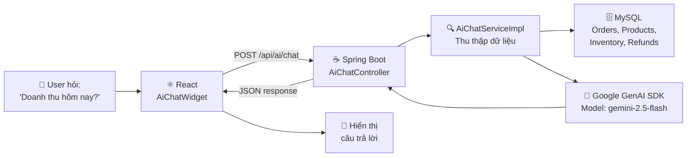
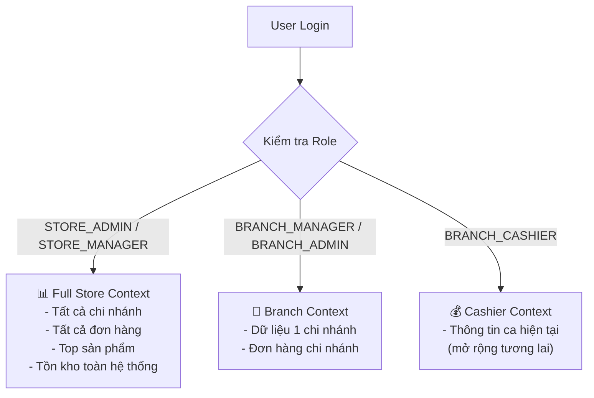

# 🤖 Hướng Dẫn AI Chatbot — Zosh POS System

> **Tính năng:** AI Chatbot trợ lý thông minh tích hợp Google Gemini AI  
> **Phiên bản:** 1.1  
> **Ngày tạo:** 2026-05-19  
> **Cập nhật:** Sử dụng Google GenAI SDK chính thức + Model `gemini-2.5-flash`

---

## 1. Tổng Quan

AI Chatbot là một **widget chat thông minh** nhúng trực tiếp vào giao diện POS, cho phép tất cả người dùng (Store Admin, Branch Manager, Cashier) hỏi bằng **ngôn ngữ tự nhiên** và nhận câu trả lời dựa trên **dữ liệu thực** từ hệ thống.

### 1.1 Kiến Trúc Hệ Thống



### 1.2 Công Nghệ Sử Dụng

| Thành phần | Công nghệ | Chi tiết |
|------------|-----------|----------|
| **AI Model** | Google Gemini 2.5 Flash | Model mới nhất, miễn phí, hỗ trợ tiếng Việt |
| **SDK** | `com.google.genai:google-genai:1.0.0` | SDK Java chính thức của Google |
| **Backend** | Spring Boot 3.5.3 + Java 17 | REST API + JPA Repository |
| **Frontend** | React + Vite | Floating widget với Lucide Icons |
| **Database** | MySQL | Lưu trữ dữ liệu POS |

### 1.3 Tính Năng Chi Tiết

| # | Tính năng | Mô tả | Trạng thái |
|---|-----------|-------|------------|
| 1 | 💬 **Chat tự nhiên** | Hỏi bằng tiếng Việt, nhận câu trả lời dựa trên dữ liệu thực | ✅ Hoàn thành |
| 2 | 📊 **Dashboard Insight** | 1-click phân tích tổng quan kinh doanh (doanh thu, xu hướng, cảnh báo) | ✅ Hoàn thành |
| 3 | 💡 **Gợi ý câu hỏi** | 8 câu hỏi mẫu phổ biến, click để hỏi nhanh | ✅ Hoàn thành |
| 4 | 🔒 **Phân quyền dữ liệu** | Context tự động thay đổi theo role: Store Admin thấy toàn bộ, Branch Manager thấy chi nhánh | ✅ Hoàn thành |
| 5 | 📈 **Phân tích doanh thu** | So sánh hôm nay vs hôm qua, top sản phẩm, doanh thu theo chi nhánh | ✅ Hoàn thành |
| 6 | 📦 **Cảnh báo tồn kho** | Liệt kê sản phẩm có số lượng ≤ 10 | ✅ Hoàn thành |
| 7 | 🌙 **Dark theme UI** | Giao diện tối, gradient tím, micro-animations | ✅ Hoàn thành |
| 8 | 🔄 **Fallback mode** | Hiển thị hướng dẫn cấu hình khi chưa có API key | ✅ Hoàn thành |

---

## 2. Cài Đặt Chi Tiết

### Bước 1: Thêm Dependency (đã tích hợp sẵn)

File `pom.xml` đã được thêm dependency SDK chính thức:

```xml
<!-- Google Gemini AI SDK -->
<dependency>
    <groupId>com.google.genai</groupId>
    <artifactId>google-genai</artifactId>
    <version>1.0.0</version>
</dependency>
```

### Bước 2: Lấy Gemini API Key (miễn phí)

1. Truy cập: **https://aistudio.google.com/apikey**
2. Đăng nhập bằng **tài khoản Gmail cá nhân** (không dùng tài khoản trường/cơ quan)
3. Click **"Create API key"** → Chọn **"Create API key in new project"**
4. Copy API key (dạng `AIzaSy...`)

> **⚠️ Lưu ý quan trọng:**
> - Phải tạo key từ **AI Studio** (không phải Google Cloud Console)
> - Chọn **"Create API key in new project"** để đảm bảo có free quota
> - Nếu gặp lỗi 429 `limit: 0`, thử tạo key từ tài khoản Gmail khác

**Giới hạn Free Tier:**

| Model | Requests/phút | Requests/ngày | Chi phí |
|-------|---------------|---------------|---------|
| `gemini-2.5-flash` | 15 | 500 | **Miễn phí** |
| `gemini-2.0-flash` | 15 | 1500 | **Miễn phí** |

### Bước 3: Cấu hình Backend

Mở file `pos-backend/src/main/resources/application.yml`, sửa dòng:

```yaml
gemini:
  api:
    key: YOUR_GEMINI_API_KEY_HERE   # ← Dán API key vào đây
```

### Bước 4: Khởi động

```bash
# Terminal 1 — Backend
cd pos-backend
./mvnw spring-boot:run

# Terminal 2 — Frontend
cd pos-frontend-vite
npm run dev
```

Khi backend khởi động thành công, sẽ thấy log:
```
✅ Gemini AI client initialized successfully
```

---

## 3. Cấu Trúc Source Code

### 3.1 Backend — Các file mới tạo

#### `AiChatService.java` — Interface
**Path:** `pos-backend/src/main/java/com/zosh/service/AiChatService.java`

```java
public interface AiChatService {
    String chat(String message, String jwt) throws UserException;
    String getDashboardInsight(String jwt) throws UserException;
    List<String> getSuggestedQuestions();
}
```

| Method | Chức năng |
|--------|-----------|
| `chat()` | Nhận câu hỏi từ user → thu thập context từ DB → gọi Gemini → trả lời |
| `getDashboardInsight()` | Tự động phân tích tổng quan kinh doanh |
| `getSuggestedQuestions()` | Trả về 8 câu hỏi gợi ý mẫu |

#### `AiChatServiceImpl.java` — Implementation chính
**Path:** `pos-backend/src/main/java/com/zosh/service/impl/AiChatServiceImpl.java`

**Logic hoạt động:**
1. **Xác thực user** qua JWT token → lấy thông tin role, store, branch
2. **Thu thập context** từ database dựa trên role:
   - Tổng quan cửa hàng (đơn hàng, doanh thu, sản phẩm, chi nhánh, hoàn trả)
   - Doanh thu hôm nay vs hôm qua
   - Top 5 sản phẩm bán chạy
   - Doanh thu theo chi nhánh
   - Sản phẩm sắp hết hàng (≤ 10)
3. **Gọi Gemini API** qua SDK chính thức với system prompt tiếng Việt
4. **Trả kết quả** cho frontend

**Công nghệ chính:**
```java
// Sử dụng Google GenAI SDK chính thức
import com.google.genai.Client;
import com.google.genai.types.GenerateContentResponse;

// Khởi tạo client
Client geminiClient = Client.builder().apiKey(geminiApiKey).build();

// Gọi API
GenerateContentResponse response = geminiClient.models.generateContent(
    "gemini-2.5-flash",  // Model
    fullPrompt,          // Prompt chứa context + câu hỏi
    null                 // Config mặc định
);
```

#### `AiChatController.java` — REST Controller
**Path:** `pos-backend/src/main/java/com/zosh/controller/AiChatController.java`

3 endpoints chính (xem mục 4).

### 3.2 Backend — Các Repository đã bổ sung query

| Repository | Query methods thêm mới | Mục đích |
|------------|----------------------|----------|
| `OrderRepository` | `countByBranch_Store_Id()` | Đếm tổng đơn hàng theo store |
| | `sumTotalAmountByBranch_Store_Id()` | Tính tổng doanh thu theo store |
| | `countByBranchId()` | Đếm đơn hàng theo chi nhánh |
| | `countAndSumByStoreIdAndDateRange()` | Doanh thu theo khoảng thời gian |
| | `findTopSellingProducts()` | Top sản phẩm bán chạy |
| | `findSalesByBranchForStore()` | Doanh thu từng chi nhánh |
| `InventoryRepository` | `findLowStockItems()` | Sản phẩm sắp hết hàng (≤ threshold) |
| `ProductRepository` | `countByStoreId()` | Đếm tổng sản phẩm |
| `BranchRepository` | `countByStoreId()` | Đếm tổng chi nhánh |
| `RefundRepository` | `countByBranch_Store_Id()` | Đếm tổng hoàn trả |

### 3.3 Frontend

#### `AiChatWidget.jsx` — Floating Chat Widget
**Path:** `pos-frontend-vite/src/components/AiChatWidget.jsx`

**Tính năng UI:**
- Floating button ở góc phải dưới (với pulse animation)
- Cửa sổ chat 400x580px, dark theme
- Header gradient tím với nút: Insight, Xóa lịch sử, Đóng
- Khu vực tin nhắn với avatar AI/User riêng biệt
- Gợi ý câu hỏi nhanh (pill buttons)
- Input field với Shift+Enter hỗ trợ
- Loading indicator khi đang xử lý
- Error state riêng biệt (viền đỏ)
- Basic markdown rendering (bold, code, list)

#### `App.jsx` — Tích hợp Widget
Widget được render cho **tất cả user đã đăng nhập**:
```jsx
{userProfile && userProfile.role && <AiChatWidget />}
```

### 3.4 Tổng hợp files

| # | File | Loại | Mô tả |
|---|------|------|-------|
| 1 | `AiChatService.java` | Mới | Interface 3 methods |
| 2 | `AiChatServiceImpl.java` | Mới | Logic AI + Gemini SDK |
| 3 | `AiChatController.java` | Mới | 3 REST endpoints |
| 4 | `AiChatWidget.jsx` | Mới | React floating widget |
| 5 | `pom.xml` | Sửa | Thêm `google-genai` dependency |
| 6 | `OrderRepository.java` | Sửa | +6 query methods |
| 7 | `InventoryRepository.java` | Sửa | +1 query method |
| 8 | `ProductRepository.java` | Sửa | +1 query method |
| 9 | `BranchRepository.java` | Sửa | +1 query method |
| 10 | `RefundRepository.java` | Sửa | +1 query method |
| 11 | `App.jsx` | Sửa | Import & render widget |

---

## 4. API Endpoints Chi Tiết

### 4.1 POST `/api/ai/chat`
Gửi câu hỏi cho AI chatbot.

**Headers:**
```
Authorization: Bearer <JWT_TOKEN>
Content-Type: application/json
```

**Request Body:**
```json
{
  "message": "Doanh thu hôm nay bao nhiêu?"
}
```

**Response (200 OK):**
```json
{
  "reply": "📊 **Doanh thu hôm nay (2026-05-19):**\n- Số đơn: 23\n- Tổng doanh thu: 5,250,000 ₫\n\n📈 So với hôm qua (4,800,000 ₫), tăng **9.4%**.\n\n💡 Gợi ý: Doanh thu đang có xu hướng tăng, hãy đảm bảo đủ hàng cho sản phẩm bán chạy!",
  "timestamp": 1716051600000
}
```

**Response (400 Bad Request):**
```json
{
  "error": "Message is required",
  "timestamp": 1716051600000
}
```

### 4.2 GET `/api/ai/dashboard-insight`
Lấy AI insight tóm tắt tự động cho dashboard.

**Headers:**
```
Authorization: Bearer <JWT_TOKEN>
```

**Response (200 OK):**
```json
{
  "insight": "📊 Tổng quan: Cửa hàng đang hoạt động ổn định với 156 đơn hàng.\n📈 Xu hướng: Doanh thu hôm nay tăng 9.4% so với hôm qua.\n⚠️ Cảnh báo: 3 sản phẩm sắp hết hàng cần nhập thêm.\n💡 Gợi ý: Tập trung bổ sung tồn kho cho chi nhánh Quận 1.",
  "timestamp": 1716051600000
}
```

### 4.3 GET `/api/ai/suggestions`
Lấy danh sách câu hỏi gợi ý nhanh (không cần xác thực).

**Response (200 OK):**
```json
{
  "suggestions": [
    "Doanh thu hôm nay bao nhiêu?",
    "Sản phẩm nào bán chạy nhất?",
    "Chi nhánh nào có doanh thu cao nhất?",
    "Có sản phẩm nào sắp hết hàng không?",
    "So sánh doanh thu hôm nay với hôm qua",
    "Tổng số đơn hàng trong tuần này?",
    "Thu ngân nào bán được nhiều nhất?",
    "Tỷ lệ hoàn trả hiện tại là bao nhiêu?"
  ]
}
```

---

## 5. Hướng Dẫn Sử Dụng

### 5.1 Mở Chat Widget
1. Đăng nhập vào hệ thống POS (bất kỳ role nào)
2. Icon 🤖 tím xuất hiện ở **góc phải dưới** màn hình (với hiệu ứng pulse)
3. Click vào icon để mở cửa sổ chat

### 5.2 Chat Tự Nhiên
1. Gõ câu hỏi bằng **tiếng Việt** vào ô input
2. Nhấn **Enter** hoặc click nút ▶️ để gửi
3. AI sẽ phân tích dữ liệu POS thực và trả lời

### 5.3 Gợi Ý Nhanh
- Khi mới mở chat, có các **pill buttons** gợi ý bên dưới
- Click vào bất kỳ gợi ý nào để hỏi nhanh
- Gợi ý sẽ ẩn đi sau khi gửi tin nhắn đầu tiên

### 5.4 Dashboard Insight
1. Click nút **"✨ Insight"** ở header chat
2. AI sẽ tự động:
   - Đánh giá tình hình tổng quan
   - Nhận xét xu hướng doanh thu
   - Đưa ra cảnh báo (nếu có)
   - Gợi ý hành động cụ thể

### 5.5 Các Câu Hỏi Mẫu

| Câu hỏi | Dữ liệu AI sử dụng | Kết quả trả về |
|---------|---------------------|----------------|
| "Doanh thu hôm nay bao nhiêu?" | `countAndSumByStoreIdAndDateRange` | Tổng doanh thu + số đơn hôm nay |
| "Sản phẩm nào bán chạy nhất?" | `findTopSellingProducts` | Top 5 sản phẩm theo số đơn + doanh thu |
| "Chi nhánh nào doanh thu cao nhất?" | `findSalesByBranchForStore` | Bảng xếp hạng chi nhánh |
| "Có sản phẩm nào sắp hết hàng?" | `findLowStockItems` | Danh sách SP tồn kho ≤ 10 |
| "So sánh doanh thu hôm nay với hôm qua" | `countAndSumByStoreIdAndDateRange` × 2 | So sánh chi tiết + % tăng/giảm |
| "Tổng số đơn hàng trong tuần này?" | `countByBranch_Store_Id` | Tổng đơn hàng toàn store |
| "Thu ngân nào bán được nhiều nhất?" | Dữ liệu context store | Xếp hạng thu ngân |
| "Tỷ lệ hoàn trả hiện tại?" | `countByBranch_Store_Id` (refund/order) | Tỷ lệ % hoàn trả |

---

## 6. Luồng Hoạt Động Chi Tiết

```mermaid
sequenceDiagram
    participant U as 👤 User
    participant FE as ⚛️ React Frontend
    participant BE as ☕ Spring Boot
    participant DB as 🗄️ MySQL
    participant AI as 🤖 Gemini 2.5 Flash

    U->>FE: Gõ "Doanh thu hôm nay?"
    FE->>BE: POST /api/ai/chat {message, JWT}
    
    Note over BE: JwtValidator xác thực
    BE->>BE: getUserFromJwtToken(jwt)
    Note over BE: Xác định role + store
    
    rect rgb(40, 40, 80)
        Note over BE,DB: Thu thập Context
        BE->>DB: countByBranch_Store_Id()
        DB-->>BE: totalOrders = 156
        BE->>DB: sumTotalAmountByBranch_Store_Id()
        DB-->>BE: totalSales = 45,200,000 ₫
        BE->>DB: countAndSumByStoreIdAndDateRange(today)
        DB-->>BE: todayOrders=23, todayRevenue=5,250,000
        BE->>DB: countAndSumByStoreIdAndDateRange(yesterday)
        DB-->>BE: yesterdayRevenue=4,800,000
        BE->>DB: findTopSellingProducts(storeId, 5)
        DB-->>BE: Top 5 products
        BE->>DB: findSalesByBranchForStore(storeId)
        DB-->>BE: Branch sales breakdown
        BE->>DB: findLowStockItems(storeId, 10)
        DB-->>BE: Low stock items
    end
    
    BE->>BE: Xây dựng context string
    BE->>AI: generateContent(model, prompt+context+question)
    AI-->>BE: "📊 Doanh thu hôm nay đạt 5,250,000 ₫..."
    BE-->>FE: {reply: "📊 Doanh thu...", timestamp: ...}
    FE-->>U: Hiển thị trong chat bubble
```



### Phân quyền Context



---

## 7. Troubleshooting

### 7.1 Lỗi thường gặp

| # | Lỗi | Nguyên nhân | Cách sửa |
|---|-----|-------------|----------|
| 1 | `⏳ AI đang bận, thử lại sau 30s` | API key hết quota tạm thời | Đợi 30-60 giây rồi thử lại |
| 2 | `🔑 API key không hợp lệ` | Key sai hoặc bị thu hồi | Tạo key mới tại aistudio.google.com/apikey |
| 3 | `⚠️ Lỗi kết nối AI` | Không gọi được Gemini API | Kiểm tra internet + API key |
| 4 | `limit: 0` trong log | Key tạo từ project không có quota | Tạo key mới chọn **"new project"** |
| 5 | Chat widget không hiện | Chưa đăng nhập | Đăng nhập trước, widget chỉ hiện cho user authenticated |
| 6 | 403 Forbidden | JWT hết hạn | Đăng nhập lại |
| 7 | "Chưa có dữ liệu" | Database trống | Tạo thêm đơn hàng demo |
| 8 | Backend không start | Thiếu dependency | Chạy `./mvnw clean install` |

### 7.2 Kiểm tra nhanh

```bash
# 1. Test API key trực tiếp
curl -s "https://generativelanguage.googleapis.com/v1beta/models/gemini-2.5-flash:generateContent?key=YOUR_API_KEY" \
  -H 'Content-Type: application/json' \
  -d '{"contents":[{"parts":[{"text":"hello"}]}]}'

# 2. Test endpoint chatbot (thay YOUR_JWT)
curl -X POST http://localhost:8080/api/ai/chat \
  -H "Content-Type: application/json" \
  -H "Authorization: Bearer YOUR_JWT" \
  -d '{"message": "Doanh thu hôm nay?"}'

# 3. Kiểm tra models có sẵn
curl -s "https://generativelanguage.googleapis.com/v1beta/models?key=YOUR_API_KEY" | python3 -c "import sys,json; [print(m['name']) for m in json.load(sys.stdin).get('models',[])]"
```

### 7.3 Thay đổi Model

Nếu `gemini-2.5-flash` bị hết quota, có thể đổi sang model khác trong file `AiChatServiceImpl.java`:

```java
// Dòng 34 — đổi model tại đây
private static final String MODEL = "gemini-2.5-flash";
// Các lựa chọn khác: "gemini-2.0-flash", "gemini-2.5-flash-lite"
```

---

## 8. Mở Rộng Thêm (Tùy Chọn)

### 8.1 Lưu lịch sử chat vào DB
Tạo entity `ChatMessage` để lưu lịch sử hội thoại, phục vụ review sau.

### 8.2 Thêm context cho Cashier
Hiện tại context tập trung cho Store Admin. Có thể mở rộng thêm dữ liệu ca làm việc (ShiftReport) hiện tại cho Cashier.

### 8.3 Thêm biểu đồ inline
Parse response AI để render biểu đồ Recharts trực tiếp trong chat widget.

### 8.4 Multi-language support
Thêm tùy chọn ngôn ngữ trả lời (Việt/Anh) dựa trên settings user.

---

## 9. Bảo Mật

- **API key** được lưu trong `application.yml` phía server, **không bao giờ gửi lên frontend**
- Tất cả requests đều qua **JWT authentication** (trừ `/suggestions`)
- Dữ liệu context được filter theo **role user** — không bao giờ lộ dữ liệu store khác
- Nếu deploy production, nên dùng **biến môi trường**:
  ```yaml
  gemini:
    api:
      key: ${GEMINI_API_KEY}
  ```

---

> **💡 Khi demo đồ án:** Hãy show AI Chatbot trước Dashboard. Gõ câu hỏi "Phân tích tổng quan kinh doanh" — AI sẽ tự động tóm tắt toàn bộ tình hình → rất ấn tượng! ✨
