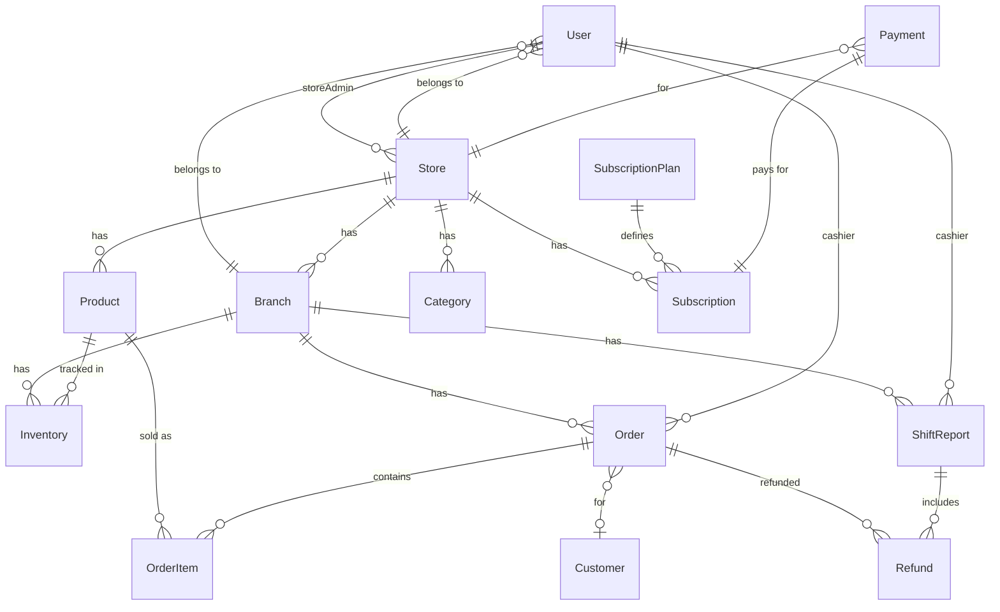
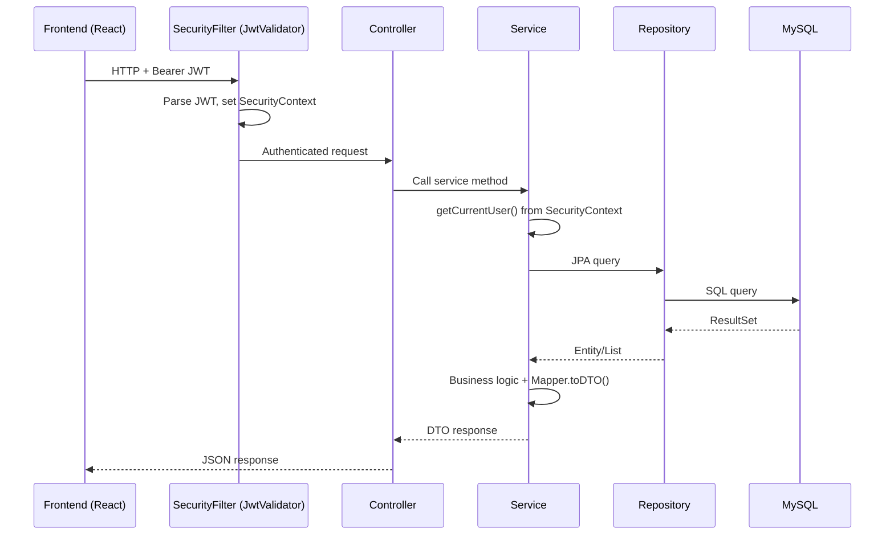

# 📋 Zosh POS Backend — Source Code Walkthrough

## 1. Tổng Quan

| Thông tin | Chi tiết |
|-----------|----------|
| **Framework** | Spring Boot 3.5.3 |
| **Java** | 17 |
| **Database** | MySQL 8.0 (JPA/Hibernate, ddl-auto: update) |
| **Security** | Spring Security + JWT (jjwt 0.12.6) |
| **Payment** | Razorpay + Stripe |
| **Email** | Spring Boot Mail (Gmail SMTP) |
| **Build** | Maven + Jib (Docker) |
| **Server Port** | 5000 |
| **Package** | `com.zosh` |

---

## 2. Kiến Trúc Package

```
com.zosh/
├── configrations/     # Security, JWT, CORS, Email
├── controller/        # 20 REST controllers
├── domain/            # 10 Enums
├── event/             # Payment events (Spring Events)
├── exception/         # Global exception handler
├── mapper/            # 12 DTO mappers
├── modal/             # 16 JPA entities
├── payload/
│   ├── dto/           # 17 DTOs
│   ├── request/       # 5 request objects
│   ├── response/      # 6 response objects
│   ├── AdminAnalysis/ # 3 admin analytics DTOs
│   └── StoreAnalysis/ # 8 store analytics DTOs
├── repository/        # 15 JPA repositories
├── service/           # 18 service interfaces
│   ├── impl/          # 18 service implementations
│   └── gateway/       # Razorpay + Stripe services
└── util/              # SecurityUtil
```

---

## 3. Database Schema (16 Entities)



### Entity Details

| Entity | Table | Key Fields |
|--------|-------|------------|
| **User** | `users` | id, fullName, email, password, phone, role, store, branch, verified, lastLogin |
| **Store** | `stores` | id, brand, storeAdmin(User), status(PENDING/ACTIVE/BLOCKED), storeType, contact(embedded) |
| **Branch** | `branches` | id, name, address, phone, email, workingDays, openTime, closeTime, store, manager |
| **Product** | `products` | id, name, sku(unique), mrp, sellingPrice, brand, image, category, store |
| **Category** | `categories` | id, name, store |
| **Order** | `orders` | id, totalAmount, branch, cashier, customer, paymentType, items, status(COMPLETED default) |
| **OrderItem** | `order_items` | id, quantity, price, product, order |
| **Customer** | `customer` | id, fullName, email, phone |
| **Inventory** | `inventories` | id, branch, product, quantity |
| **ShiftReport** | `shift_report` | id, shiftStart, shiftEnd, totalSales, totalRefunds, netSales, totalOrders, cashier, branch |
| **Refund** | `refund` | id, order, reason, amount, cashier, branch, shiftReport, paymentType |
| **Subscription** | `subscriptions` | id, store, plan, startDate, endDate, status, paymentGateway, paymentStatus |
| **SubscriptionPlan** | `subscription_plans` | id, name, price, billingCycle, maxBranches, maxUsers, maxProducts, feature flags |
| **Payment** | `payment` | id, store, subscription, amount, provider, status, transactionId |
| **PaymentOrder** | `payment_order` | id, amount, status, paymentLinkId, user, planId |
| **PasswordResetToken** | `password_reset_tokens` | id, token, user, expiryDate |

---

## 4. Enums (Domain)

| Enum | Values |
|------|--------|
| `UserRole` | ROLE_ADMIN, ROLE_STORE_ADMIN, ROLE_STORE_MANAGER, ROLE_BRANCH_MANAGER, ROLE_BRANCH_ADMIN, ROLE_BRANCH_CASHIER, ROLE_CUSTOMER |
| `StoreStatus` | ACTIVE, PENDING, BLOCKED |
| `OrderStatus` | COMPLETED, PENDING, REFUNDED, CANCELLED |
| `PaymentType` | CARD, UPI, CASH |
| `PaymentStatus` | PENDING, SUCCESS, FAILED |
| `PaymentGateway` | RAZORPAY, STRIPE |
| `SubscriptionStatus` | TRIAL, ACTIVE, EXPIRED, CANCELLED |
| `BillingCycle` | MONTHLY, YEARLY |

---

## 5. Security & Authentication

### JWT Flow
1. **Login/Signup** → `AuthController` → `AuthServiceImpl.login()/signup()`
2. JWT generated via `JwtProvider.generateToken()` with claims: `email`, `authorities`
3. Token expiry: **24 hours** (86400000ms)
4. Secret key: hardcoded in `JwtConstant.SECRET_KEY`
5. **Every request** → `JwtValidator` filter extracts JWT from `Authorization` header → sets `SecurityContext`

### Security Rules
```
/auth/**          → permitAll (login, signup, forgot/reset password)
/api/**           → authenticated (requires JWT)
/api/super-admin/** → hasRole("ADMIN")
Everything else   → permitAll
```

### CORS Origins
- `http://localhost:3000`, `http://localhost:5173`
- `https://zosh-pos.vercel.app`, `https://pos-sytem-bcs6.vercel.app`

### Data Initialization
- On startup, `DataInitializationComponent` creates a Super Admin:
  - Email: `codewithzosh@gmail.com`, Password: `codewithzosh`, Role: `ROLE_ADMIN`

---

## 6. REST API Endpoints (20 Controllers)

### Auth (`/auth`)
| Method | Path | Description |
|--------|------|-------------|
| POST | `/signup` | Register user (blocks ROLE_ADMIN) |
| POST | `/login` | Login → returns JWT |
| POST | `/forgot-password` | Send reset email (5min token) |
| POST | `/reset-password` | Reset password with token |

### Users (`/api/users`, `/users`)
| Method | Path | Description |
|--------|------|-------------|
| GET | `/api/users/profile` | Get current user from JWT |
| GET | `/api/users/customer` | List all ROLE_CUSTOMER users |
| GET | `/api/users/cashier` | List all ROLE_BRANCH_CASHIER users |
| GET | `/users/list` | List all users |
| GET | `/users/{userId}` | Get user by ID |

### Stores (`/api/stores`)
| Method | Path | Auth | Description |
|--------|------|------|-------------|
| POST | `/` | JWT | Create store |
| GET | `/{id}` | JWT | Get store by ID |
| PUT | `/{id}` | JWT | Update store |
| DELETE | `/` | JWT | Delete current user's store |
| GET | `/admin` | JWT | Get store by admin (current user) |
| GET | `/employee` | JWT | Get store by employee |
| GET | `/{storeId}/employee/list` | STORE_ADMIN/MANAGER | List employees |
| POST | `/add/employee` | STORE_ADMIN/MANAGER | Add employee |
| GET | `/` | JWT | List all stores (optionally filter by status) |
| PUT | `/{storeId}/moderate` | ADMIN | Approve/block store |

### Branches (`/api/branches`)
| Method | Path | Description |
|--------|------|-------------|
| POST | `/` | Create branch |
| GET | `/{id}` | Get branch |
| GET | `/store/{storeId}` | All branches of a store |
| PUT | `/{id}` | Update branch |
| DELETE | `/{id}` | Delete branch |

### Products (`/api/products`)
| Method | Path | Description |
|--------|------|-------------|
| POST | `/` | Create product (checks store authority) |
| GET | `/{id}` | Get product |
| PATCH | `/{id}` | Update product |
| DELETE | `/{id}` | Delete product |
| GET | `/store/{storeId}` | Products by store |
| GET | `/store/{storeId}/search?q=` | Search products |

### Orders (`/api/orders`)
| Method | Path | Auth | Description |
|--------|------|------|-------------|
| POST | `/` | CASHIER | Create order (auto-assigns branch from cashier) |
| GET | `/{id}` | JWT | Get order |
| GET | `/branch/{branchId}` | JWT | Orders by branch (filterable) |
| GET | `/cashier/{cashierId}` | JWT | Orders by cashier |
| GET | `/today/branch/{branchId}` | JWT | Today's orders |
| GET | `/customer/{customerId}` | JWT | Customer's orders |
| GET | `/recent/{branchId}` | BRANCH_MANAGER | Top 5 recent orders |
| DELETE | `/{id}` | STORE_ADMIN/MANAGER | Delete order |

### Shift Reports (`/api/shift-reports`)
| Method | Path | Description |
|--------|------|-------------|
| POST | `/start?branchId=` | Start shift (1 per day per cashier) |
| PATCH | `/end` | End shift → calculates totals |
| GET | `/current` | Current shift progress (live) |
| GET | `/cashier/{id}/by-date` | Shift by date |
| GET | `/cashier/{id}` | All shifts for cashier |
| GET | `/branch/{id}` | All shifts for branch |
| GET | `/` | All shifts |
| GET | `/{id}` | Shift by ID |
| DELETE | `/{id}` | Delete shift |

### Refunds, Customers, Categories, Employees, Inventory
Standard CRUD patterns matching frontend thunks.

### Analytics
- **Branch**: `/api/branch-analytics/` → daily-sales, top-products, top-cashiers, category-sales, today-overview, payment-breakdown
- **Store**: `/api/store/analytics/{storeAdminId}/` → overview, sales-trends, sales/monthly, sales/daily, sales/category, sales/payment-method, sales/branch, branch-performance, alerts
- **Admin**: `/api/super-admin/dashboard/` → summary, store-registrations, store-status-distribution

### Subscriptions & Plans
- `/api/subscriptions/` → subscribe, upgrade, activate, cancel, payment-status
- `/api/super-admin/subscription-plans/` → CRUD for plans

---

## 7. Business Logic Highlights

### Order Creation Flow
```
Cashier creates order → OrderServiceImpl:
1. Get current user (cashier) from SecurityContext
2. Get cashier's branch
3. Map OrderItemDTOs → resolve Product entities
4. Calculate price = sellingPrice × quantity for each item
5. Sum total amount
6. Save order with COMPLETED status
```

### Shift Report Flow
```
Start Shift → Prevent duplicate (1/day/cashier) → Save with shiftStart
End Shift → Query orders & refunds between shiftStart↔now →
  Calculate: totalSales, totalRefunds, netSales, totalOrders
  Compute: paymentSummaries (grouped by PaymentType)
  Find: topSellingProducts (top 5), recentOrders (last 5)
  Save all computed data
```

### Refund Flow
```
Cashier creates refund → Find order → Set amount = order.totalAmount →
  Save refund → Update order status to REFUNDED
```

### Subscription/Payment Flow
```
Store subscribes to plan → Create Subscription (ACTIVE, payment PENDING) →
  Create Payment entity → Initiate via Razorpay/Stripe →
  Return checkout URL → User pays externally →
  Verify callback → Update payment status → Publish events
```

---

## 8. Data Flow Architecture



---

## 9. File Statistics

| Category | Count |
|----------|-------|
| JPA Entities | 16 |
| Controllers | 20 |
| Service Interfaces | 18 |
| Service Implementations | 18 + 2 gateways |
| Repositories | 15 |
| DTOs | 30+ |
| Mappers | 12 |
| Enums | 10 |
| **Total Java files** | **~130** |
