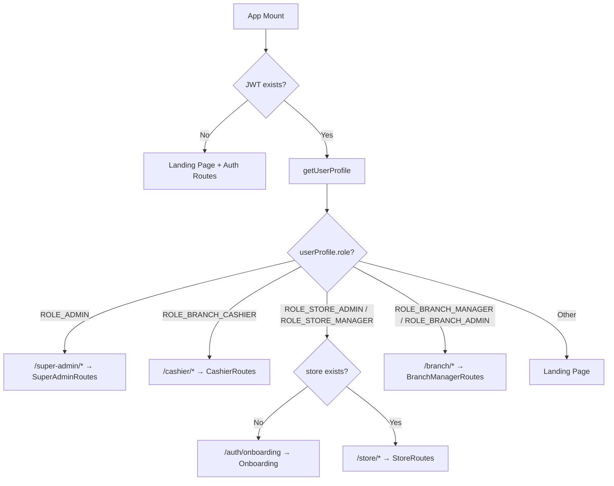
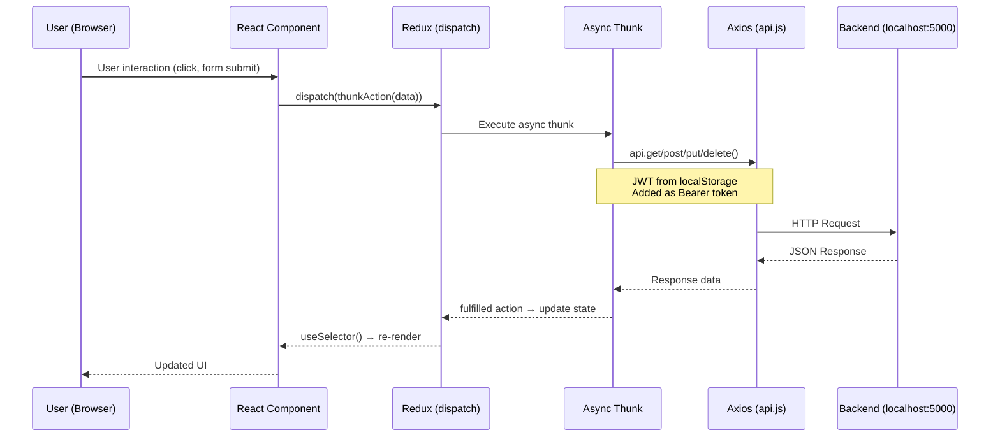

# 📋 Zosh POS Frontend — Source Code Walkthrough

## 1. Tổng Quan Dự Án

**Zosh POS** là hệ thống quản lý bán hàng (Point of Sale) dạng multi-tenant, hỗ trợ nhiều cửa hàng, nhiều chi nhánh, nhiều role người dùng.

| Thông tin | Chi tiết |
|-----------|----------|
| **Framework** | React 19 + Vite 7 |
| **Language** | JavaScript (JSX) |
| **State Management** | Redux Toolkit |
| **Routing** | React Router v7 |
| **UI Library** | shadcn/ui (Radix UI + Tailwind CSS v4) |
| **HTTP Client** | Axios |
| **Charts** | Recharts |
| **PDF** | @react-pdf/renderer |
| **Form** | React Hook Form + Formik + Yup + Zod |
| **Theme** | next-themes (light/dark) |
| **Upload** | Cloudinary |
| **Backend API** | `http://localhost:5000` |

---

## 2. Cấu Trúc Thư Mục

```
pos-frontend-vite/
├── index.html                  # Entry HTML (font: Winky Rough)
├── vite.config.js              # Vite config + Tailwind plugin + alias @/
├── package.json                # Dependencies
├── src/
│   ├── main.jsx                # React entry point
│   ├── App.jsx                 # Root component (role-based routing)
│   ├── App.css                 # Minimal app styles
│   ├── index.css               # Tailwind + Theme variables (oklch colors)
│   ├── components/
│   │   ├── theme-provider.jsx  # Dark/light theme wrapper
│   │   ├── theme-toggle.jsx    # Theme toggle button
│   │   └── ui/                 # 48 shadcn/ui components
│   ├── context/
│   │   ├── SidebarContext.jsx  # Sidebar open/close context
│   │   └── SidebarProvider.jsx # Sidebar state provider
│   ├── contexts/               # (Trống)
│   ├── hooks/
│   │   └── use-mobile.js       # Mobile detection hook
│   ├── lib/
│   │   └── utils.js            # cn() utility (clsx + tailwind-merge)
│   ├── utils/
│   │   ├── api.js              # Axios instance (baseURL: localhost:5000)
│   │   ├── formateDate.js      # formatDateTime, formatTime
│   │   ├── getPaymentIcon.jsx  # Icon cho CASH/CARD/UPI
│   │   ├── getStatusColor.js   # Badge color theo status
│   │   ├── paymentMethodLable.js # Label cho payment method
│   │   ├── uploadToCloudinary.js # Upload ảnh lên Cloudinary
│   │   └── userRole.js         # Danh sách các role
│   ├── Redux Toolkit/
│   │   ├── globleState.js      # Redux store config (22 reducers)
│   │   └── features/           # 22 feature modules
│   ├── routes/                 # 5 route files
│   └── pages/                  # Tất cả trang UI
```

---

## 3. Entry Point & Khởi Tạo App

### [main.jsx](file:///Users/Study/DOAN/z%20pos-source-code_1/pos-frontend-vite/src/main.jsx)

```
StrictMode
  └── BrowserRouter
       └── Redux Provider (store = globleState)
            └── ThemeProvider (system theme)
                 ├── App
                 └── Toaster (toast notifications)
```

### [App.jsx](file:///Users/Study/DOAN/z%20pos-source-code_1/pos-frontend-vite/src/App.jsx)

App.jsx là **bộ não routing** chính:

1. Khi mount → lấy JWT từ `localStorage` → dispatch `getUserProfile(jwt)`
2. Nếu user là `ROLE_STORE_ADMIN` → dispatch `getStoreByAdmin()` để lấy thông tin cửa hàng
3. Dựa vào `userProfile.role` → render route tương ứng:



---

## 4. Hệ Thống Routing (5 Route Groups)

### 4.1. Auth Routes — `/auth/*`
| Path | Component |
|------|-----------|
| `/auth/login` | Login |
| `/auth/onboarding` | Onboarding |
| `/auth/forgot-password` | ForgotPasswordPage (placeholder) |
| `/auth/reset-password` | ResetPassword |

### 4.2. Store Routes — `/store/*` (ROLE_STORE_ADMIN / ROLE_STORE_MANAGER)
Layout wrapper: `StoreDashboard` (sidebar + topbar + outlet)

| Path | Component |
|------|-----------|
| `/store/dashboard` | Dashboard |
| `/store/branches` | Branches |
| `/store/categories` | Categories |
| `/store/employees` | StoreEmployees |
| `/store/products` | Products |
| `/store/stores` | Stores (store info) |
| `/store/sales` | Sales |
| `/store/reports` | Reports |
| `/store/upgrade` | Upgrade |
| `/store/settings` | Settings |
| `/store/alerts` | Alerts |

### 4.3. Branch Manager Routes — `/branch/*` (ROLE_BRANCH_MANAGER / ROLE_BRANCH_ADMIN)
Layout wrapper: `BranchManagerDashboard`

| Path | Component |
|------|-----------|
| `/branch/dashboard` | Dashboard |
| `/branch/orders` | Orders |
| `/branch/refunds` | Refunds |
| `/branch/transactions` | Transactions |
| `/branch/inventory` | Inventory |
| `/branch/employees` | BranchEmployees |
| `/branch/customers` | Customers |
| `/branch/reports` | Reports |
| `/branch/settings` | Settings |

### 4.4. Cashier Routes — `/cashier/*` (ROLE_BRANCH_CASHIER)
Layout wrapper: `CashierDashboardLayout`

| Path | Component |
|------|-----------|
| `/cashier/` (index) | CreateOrderPage (POS screen) |
| `/cashier/orders` | OrderHistoryPage |
| `/cashier/returns` | ReturnOrderPage |
| `/cashier/customers` | CustomerLookupPage |
| `/cashier/shift-summary` | ShiftSummaryPage |

### 4.5. Super Admin Routes — `/super-admin/*` (ROLE_ADMIN)
Layout wrapper: `SuperAdminDashboard`

| Path | Component |
|------|-----------|
| `/super-admin/dashboard` | Dashboard |
| `/super-admin/stores` | StoreListPage |
| `/super-admin/stores/:id` | StoreDetailsPage |
| `/super-admin/requests` | PendingRequestsPage |
| `/super-admin/subscriptions` | SubscriptionPlansPage |
| `/super-admin/settings` | SettingsPage |

---

## 5. Redux Toolkit — State Management

### [globleState.js](file:///Users/Study/DOAN/z%20pos-source-code_1/pos-frontend-vite/src/Redux%20Toolkit/globleState.js) — 22 Reducers

```mermaid
graph LR
    subgraph "Redux Store"
        A["auth"] --> A1["user, loading, isAuthenticated, forgotPassword, resetPassword"]
        B["user"] --> B1["userProfile, users, customers, cashiers, selectedUser"]
        C["store"] --> C1["store, stores, employees"]
        D["branch"] --> D1["branch, branches, employees"]
        E["product"] --> E1["products, product, searchResults"]
        F["category"] --> F1["categories"]
        G["employee"] --> G1["employees, employee"]
        H["inventory"] --> H1["inventories, inventory"]
        I["order"] --> I1["orders, todayOrders, customerOrders, selectedOrder, recentOrders"]
        J["customer"] --> J1["customers, selectedCustomer"]
        K["cart"] --> K1["items, selectedCustomer, note, discount, paymentMethod, heldOrders"]
        L["sale"] --> L1["sale, sales"]
        M["transaction"] --> M1["transaction, transactions"]
        N["shiftReport"] --> N1["shifts, currentShift, selectedShift"]
        O["refund"] --> O1["refunds, refundsByCashier, refundsByBranch"]
        P["branchAnalytics"] --> P1["analytics data"]
        Q["storeAnalytics"] --> Q1["analytics data"]
        R["adminDashboard"] --> R1["admin dashboard data"]
        S["subscriptionPlan"] --> S1["plans, selectedPlan"]
        T["subscription"] --> T1["subscriptions, expiringSubscriptions"]
        U["payment"] --> U1["paymentLink, status"]
        V["onboarding"] --> V1["onboarding data"]
    end
```



### Chi Tiết Từng Feature Slice

#### 🔐 Auth (`auth`)
- **Actions**: `login`, `signup`, `forgotPassword`, `resetPassword`
- **State**: `user`, `loading`, `error`, `isAuthenticated`, forgot/reset password states
- **API**: `POST /auth/login`, `POST /auth/signup`, `POST /auth/forgot-password`, `POST /auth/reset-password`
- JWT lưu vào `localStorage` key `"jwt"`

#### 👤 User (`user`)
- **Thunks**: `getUserProfile`, `getCustomers`, `getCashiers`, `getAllUsers`, `getUserById`, `logout`
- **API**: `GET /api/users/profile`, `GET /api/users/customer`, `GET /api/users/cashier`
- Auth header: `Bearer <jwt>`

#### 🏪 Store (`store`)
- **Thunks**: `createStore`, `getStoreById`, `getAllStores`, `updateStore`, `deleteStore`, `getStoreByAdmin`, `getStoreByEmployee`, `getStoreEmployees`, `addEmployee`, `moderateStore`
- **API**: `/api/stores/*`
- Moderate: `PUT /api/stores/{id}/moderate?action=approve|block|reject`

#### 🏢 Branch (`branch`)
- **Thunks**: `createBranch`, `getBranchById`, `getAllBranchesByStore`, `updateBranch`, `deleteBranch`
- **API**: `/api/branches/*`

#### 📦 Product (`product`)
- **Thunks**: `createProduct`, `getProductById`, `updateProduct`, `deleteProduct`, `getProductsByStore`, `searchProducts`
- **API**: `/api/products/*`, search: `/api/products/store/{storeId}/search?q=`

#### 🏷️ Category (`category`)
- **Thunks**: `createCategory`, `getCategoriesByStore`, `updateCategory`, `deleteCategory`

#### 👷 Employee (`employee`)
- **Thunks**: `createStoreEmployee`, `createBranchEmployee`, `updateEmployee`, `deleteEmployee`, `findEmployeeById`, `findStoreEmployees`, `findBranchEmployees`

#### 📋 Inventory (`inventory`)
- **Thunks**: `createInventory`, `updateInventory`, `deleteInventory`, `getInventoryById`, `getInventoryByBranch`, `getInventoryByProduct`

#### 🛒 Cart (`cart`) — Client-side only, không gọi API
- **Reducers**: `addToCart`, `updateCartItemQuantity`, `removeFromCart`, `clearCart`, `holdOrder`, `resumeOrder`, `setCurrentOrder`, `resetOrder`
- **Selectors**: `selectSubtotal`, `selectTax` (18% GST), `selectDiscountAmount`, `selectTotal`
- Hỗ trợ **hold orders** (tạm giữ đơn hàng) và **resume** (khôi phục lại)

#### 📝 Order (`order`)
- **Thunks**: `createOrder`, `getOrderById`, `getOrdersByBranch`, `getOrdersByCashier`, `getTodayOrdersByBranch`, `deleteOrder`, `getOrdersByCustomer`, `getRecentOrdersByBranch`
- **API**: `/api/orders/*`
- Branch orders hỗ trợ filter: `customerId`, `cashierId`, `paymentType`, `status`

#### 🧑‍🤝‍🧑 Customer (`customer`)
- **Thunks**: `createCustomer`, `updateCustomer`, `deleteCustomer`, `getCustomerById`, `getAllCustomers`

#### 💰 Sale (`sale`)
- **Thunks**: `createSale`, `getSaleById`, `getAllSales`, `getSalesByDateRange`, `getSalesByBranch`, `getSalesByEmployee`, `getSalesByPaymentMethod`

#### 💳 Transaction (`transaction`)
- **Thunks**: `createTransaction`, `getTransactionById`, `getAllTransactions`, `getTransactionsByDateRange`, `getTransactionsByType`, `getTransactionsByPaymentMethod`

#### ⏱️ Shift Report (`shiftReport`)
- **Thunks**: `startShift`, `endShift`, `getCurrentShiftProgress`, `getShiftReportByDate`, `getShiftsByCashier`, `getShiftsByBranch`, `getAllShifts`, `getShiftById`, `deleteShift`

#### 🔄 Refund (`refund`)
- **Thunks**: `createRefund`, `getAllRefunds`, `getRefundsByCashier`, `getRefundsByBranch`, `getRefundsByShift`, `getRefundsByCashierAndDateRange`, `getRefundById`, `deleteRefund`

#### 💳 Payment (`payment`)
- **Thunks**: `createPaymentLinkThunk`, `proceedPaymentThunk`

#### 📊 Subscription Plan (`subscriptionPlan`)
- **Thunks**: `createSubscriptionPlan`, `updateSubscriptionPlan`, `getAllSubscriptionPlans`, `getSubscriptionPlanById`, `deleteSubscriptionPlan`

#### 📝 Subscription (`subscription`)
- **Thunks**: `subscribeToPlan`, `upgradeSubscription`, `activateSubscription`, `cancelSubscription`, `updatePaymentStatus`, `getStoreSubscriptions`, `getAllSubscriptions`, `getExpiringSubscriptions`, `countSubscriptionsByStatus`

#### 📈 Analytics
- `branchAnalytics` — Phân tích dữ liệu chi nhánh
- `storeAnalytics` — Phân tích dữ liệu cửa hàng
- `adminDashboard` — Dashboard cho Super Admin

---

## 6. Các Trang Chính (Pages)

### 6.1. Landing Page & Auth
| File | Mô tả |
|------|--------|
| `Landing.jsx` | Trang chủ với hero, features, pricing, testimonials, FAQ |
| `HeroSection.jsx` | Banner chính với typewriter text effect |
| `PricingSection.jsx` | Bảng giá gói subscription |
| `Login.jsx` | Form đăng nhập |
| `ResetPassword.jsx` | Form đặt lại mật khẩu |

### 6.2. Onboarding
| File | Mô tả |
|------|--------|
| `Onboarding.jsx` | Wizard tạo store mới (14KB — file lớn) |
| `OwnerDetailsForm.jsx` | Form thông tin chủ store |
| `StoreDetailsForm.jsx` | Form thông tin store |

### 6.3. Store Admin Pages (`/store/*`)
| Thư mục | Mô tả |
|---------|--------|
| `Dashboard/` | Dashboard tổng quan: stats, sales trend, recent sales, sidebar, topbar |
| `Branch/` | CRUD chi nhánh (Branches, BranchForm, BranchTable) |
| `Category/` | CRUD danh mục (Categories, CategoryForm, CategoryTable) |
| `Employee/` | CRUD nhân viên cửa hàng |
| `Product/` | CRUD sản phẩm (tạo, sửa, xóa, search, table, details) |
| `Settings/` | Cài đặt store, notification, payment, security |
| `storeInformation/` | Xem/sửa thông tin store |
| `Alerts/` | Cảnh báo: tồn kho thấp, cashier không hoạt động, refund spike, branch chưa bán |
| `store-admin/` | Báo cáo (Reports) và doanh số (Sales) |
| `upgrade/` | Nâng cấp gói subscription |

### 6.4. Branch Manager Pages (`/branch/*`)
| Thư mục | Mô tả |
|---------|--------|
| `Dashboard/` | Dashboard chi nhánh |
| `Orders/` | Quản lý đơn hàng |
| `Refunds/` | Quản lý hoàn trả |
| `Transaction/` | Quản lý giao dịch |
| `Inventory/` | Quản lý tồn kho |
| `Employees/` | Quản lý nhân viên chi nhánh |
| `Customers/` | Quản lý khách hàng |
| `Reports/` | Báo cáo |
| `Settings/` | Cài đặt |

### 6.5. Cashier Pages (`/cashier/*`)
| File/Thư mục | Mô tả |
|--------------|--------|
| `CashierDashboardLayout.jsx` | Layout chính cho cashier (sidebar + content) |
| `CreateOrderPage.jsx` | **Trang POS chính** — chọn sản phẩm, thêm vào giỏ |
| `product/ProductCard.jsx` | Card hiển thị sản phẩm |
| `product/ProductSection.jsx` | Khu vực chọn sản phẩm |
| `cart/CartSection.jsx` | Giỏ hàng |
| `cart/CartItem.jsx` | Từng item trong giỏ |
| `cart/CartSummary.jsx` | Tóm tắt giỏ hàng |
| `payment/PaymentDialog.jsx` | Dialog thanh toán |
| `payment/PaymentSection.jsx` | Chọn phương thức thanh toán |
| `payment/DiscountSection.jsx` | Áp dụng giảm giá |
| `payment/CustomerSection.jsx` | Chọn khách hàng |
| `customer/CustomerLookupPage.jsx` | Tra cứu khách hàng |
| `customer/CustomerDialog.jsx` | Dialog thêm/sửa khách hàng |
| `order/OrderHistoryPage.jsx` | Lịch sử đơn hàng |
| `order/OrderDetails/` | Chi tiết đơn hàng + xuất PDF |
| `return/ReturnOrderPage.jsx` | Hoàn trả sản phẩm |
| `ShiftSummary/ShiftSummaryPage.jsx` | Tổng kết ca làm việc |
| `components/HeldOrdersDialog.jsx` | Dialog đơn hàng tạm giữ |
| `components/ReceiptDialog.jsx` | Dialog in hóa đơn |

### 6.6. Super Admin Pages (`/super-admin/*`)
| File | Mô tả |
|------|--------|
| `Dashboard.jsx` | Dashboard tổng (stats, charts) |
| `CommissionsPage.jsx` | Quản lý hoa hồng |
| `ExportsPage.jsx` | Xuất dữ liệu |
| `store/StoreListPage.jsx` | Danh sách cửa hàng |
| `store/StoreDetailsPage.jsx` | Chi tiết cửa hàng |
| `store/PendingRequestsPage.jsx` | Duyệt yêu cầu mới |
| `subscription/SubscriptionPlansPage.jsx` | Quản lý gói subscription |
| `settings/SettingsPage.jsx` | Cài đặt hệ thống |

---

## 7. UI Components (shadcn/ui)

Dự án sử dụng **48 shadcn/ui components** dựa trên Radix UI:

````carousel
### Form & Input
- `button.jsx`, `input.jsx`, `textarea.jsx`, `label.jsx`
- `checkbox.jsx`, `radio-group.jsx`, `switch.jsx`, `slider.jsx`
- `select.jsx`, `form.jsx`, `input-otp.jsx`
<!-- slide -->
### Layout & Navigation
- `card.jsx`, `dialog.jsx`, `sheet.jsx`, `drawer.jsx`
- `tabs.jsx`, `accordion.jsx`, `collapsible.jsx`
- `sidebar.jsx` (20KB — component phức tạp nhất)
- `navigation-menu.jsx`, `menubar.jsx`
<!-- slide -->
### Data Display
- `table.jsx`, `badge.jsx`, `avatar.jsx`, `skeleton.jsx`
- `progress.jsx`, `separator.jsx`, `aspect-ratio.jsx`
- `chart.jsx` (Recharts wrapper)
- `calendar.jsx`, `carousel.jsx`
<!-- slide -->
### Feedback & Overlay
- `toast.jsx`, `use-toast.jsx`, `sonner.jsx`
- `alert.jsx`, `alert-dialog.jsx`
- `tooltip.jsx`, `popover.jsx`, `hover-card.jsx`
- `dropdown-menu.jsx`, `context-menu.jsx`
- `command.jsx` (command palette)
- `scroll-area.jsx`, `resizable.jsx`
````

---

## 8. Utilities & Helpers

| File | Chức năng |
|------|-----------|
| [api.js](file:///Users/Study/DOAN/z%20pos-source-code_1/pos-frontend-vite/src/utils/api.js) | Axios instance → `http://localhost:5000` |
| [userRole.js](file:///Users/Study/DOAN/z%20pos-source-code_1/pos-frontend-vite/src/utils/userRole.js) | 6 roles: STORE_ADMIN, STORE_MANAGER, BRANCH_MANAGER, BRANCH_ADMIN, BRANCH_CASHIER, CUSTOMER |
| [uploadToCloudinary.js](file:///Users/Study/DOAN/z%20pos-source-code_1/pos-frontend-vite/src/utils/uploadToCloudinary.js) | Upload ảnh lên Cloudinary (cloud_name: `dxoqwusir`) |
| [formateDate.js](file:///Users/Study/DOAN/z%20pos-source-code_1/pos-frontend-vite/src/utils/formateDate.js) | `formatDateTime()`, `formatTime()` |
| [getPaymentIcon.jsx](file:///Users/Study/DOAN/z%20pos-source-code_1/pos-frontend-vite/src/utils/getPaymentIcon.jsx) | Icon cho CASH (green), CARD (blue), UPI (purple) |
| [getStatusColor.js](file:///Users/Study/DOAN/z%20pos-source-code_1/pos-frontend-vite/src/utils/getStatusColor.js) | Badge colors: completed (green), processing (primary), pending (yellow) |
| [paymentMethodLable.js](file:///Users/Study/DOAN/z%20pos-source-code_1/pos-frontend-vite/src/utils/paymentMethodLable.js) | Label text cho payment methods |

---

## 9. Theme System

### Light Mode
- Primary: `oklch(0.26 0.05 173)` — Dark teal/green
- Background: White

### Dark Mode
- Primary: `oklch(0.645 0.246 16.439)` — Vivid red/coral
- Background: `oklch(0.141 0.005 285.823)` — Very dark

Hỗ trợ **system theme detection** thông qua `next-themes` ThemeProvider.

---

## 10. API Endpoints Summary

| Module | Base Path | Methods |
|--------|-----------|---------|
| Auth | `/auth/` | POST login, signup, forgot-password, reset-password |
| Users | `/api/users/` | GET profile, customer, cashier |
| Stores | `/api/stores/` | GET, POST, PUT, DELETE + `/admin`, `/employee`, `/moderate` |
| Branches | `/api/branches/` | CRUD + `/store/{storeId}` |
| Products | `/api/products/` | CRUD + `/store/{storeId}`, `/search` |
| Orders | `/api/orders/` | CRUD + `/branch/{id}`, `/cashier/{id}`, `/today/branch/{id}`, `/customer/{id}`, `/recent/{id}` |
| Customers | `/api/customers/` | CRUD |
| Employees | `/api/employees/` | CRUD + store/branch |
| Inventory | `/api/inventory/` | CRUD + `/branch/{id}`, `/product/{id}` |
| Sales | `/api/sales/` | CRUD + date-range, branch, employee, payment-method |
| Transactions | `/api/transactions/` | CRUD + date-range, type, payment-method |
| Shift Reports | `/api/shift-reports/` | start, end, progress, by-date, by-cashier, by-branch |
| Refunds | `/api/refunds/` | CRUD + by-cashier, by-branch, by-shift |
| Payments | `/api/payments/` | create-link, proceed |
| Subscriptions | `/api/subscriptions/` | subscribe, upgrade, activate, cancel |
| Subscription Plans | `/api/subscription-plans/` | CRUD |

---

## 11. Data Flow (Luồng Dữ Liệu)



---

## 12. Tổng Số File

| Loại | Số lượng |
|------|----------|
| **Redux slices** | 22 files |
| **Redux thunks** | 22 files |
| **Route files** | 5 files |
| **UI components (shadcn)** | 48 files |
| **Page components** | ~100+ files |
| **Utility files** | 8 files |
| **Total JS/JSX files** | ~200+ files |
